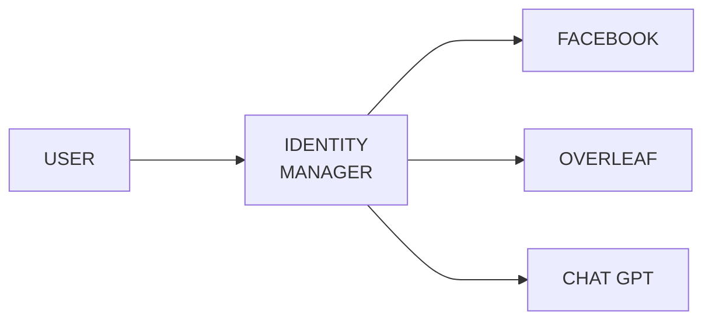

L'autenticazione passwordless è una tecnica che evita l'uso delle password. Sopratutto negli ultimi anni è stata oggetto di sviluppo e ricerca.

## FIDO Alliance & WebAuthn
Una delle organizzazioni più attive da questo punto di vista è sicuramente FIDO Alliance, quest'ultima comprende diverse aziende importanti nel settore IT, e si è concentrata sullo sviluppo di protocolli di autenticazione passwordless basati sulla crittografia asimmetrica.

Questi protocolli hanno diversi pro, innanzittutto riescono a sostituire completamente l'uso delle password; inoltre si prefissano di essere ==resistenti al phishing==, ==resistenti ad attacchi di replay== (dipende dall'implementazione in realtà) e ==solidi dal punto di vista della privacy utente==.

L'ultima suite protocollare ideata da FIDO Alliance è stata nominata FIDO2 e comprende il protocollo **WebAuthn**, quest'utime gestisce la comunicazione tra client e server.

Gli attori coinvolto in una generale comunicazione di autenticazione passwordless sono 4:
- l'utente
- il relying party, ovvero l'azienda/ente che offre il servizio a cui l'utente vuole accedere
- il dispositivo utente
- l'autenticatore, ovvero il mezzo fisico utilizzato per l'autenticazione

Qua si apre tutta la parte dedicata a WebAuthn, vattela a rivedere nel materiale della tesi.


## Single Sign On (SSO)
In generale, il Single Sign On è una soluzione di autenticazione che permette agli utenti di accedere a più applicazione, siti web e servizi, eseguendo una singola autenticazione.


L'**identity manager** è il gestore delle identità digitale, ed è colui che permette di accedere ai diversi servizi a seguito dell'autenticazione. Esso gestisce le identità digitale dei suoi utenti in modo centralizzato:
- mantiene le identità degli utenti e gli attributi ad esse associati
- verifica le identità degli utenti in base agli attributi

L'**identità digitale** è ciò che distingue un utente virtuale da un altro; infatti è la rappresentazione digitale delle informazioni che contraddistinguono un individuo.

Possiamo individuare tre attori:
- l'utente
- l'identity provider, colui che funge da identity manager e che genera l'*assertion*
- il service provider, colui che offre il servizio che necessita di auth e che quindi consuma l'*assertion*
Diciamo, per ora, che l'*assertion* è una specie di challenge.

Spesso è utile accedere a servizi esposti su altri domini a partire da un dominio di partenza. In un ambiente di **cross-domain SSO**, gli utenti autenticati in un dominio hanno accesso automatico e senza necessità di riautenticazione a risorse o servizi in altri domini.

Ci sono diversi modi in cui è possibile implementare il Single Sign On e nello specifico il Federated SSO (vengono stabiliti degli accordi tra organizzazione, quando un utente si logga in una ottiene l'accesso anche a tutte le altre confederate):
- SAML (Security Assertion Markup Language)
- OAuth + OpenID Connect
- JWT (Json Web Token)

## SAML
SAML è uno standard XML basato sullo scambio di token che permette l'autenticazione e l'autorizzazione tra domini.

In questo contesto, un Identity Provider (IdP) emette un'assertion (**dichiarazione di sicurezza**) dopo che un utente si è autenticato con successo. Questa assertion **contiene informazioni sulla sessione di autenticazione**, i diritti dell'utente e altre affermazioni pertinenti.

SAML ammette tre diverse tipologie di assertion:
- **authentication statements** - descrive i mezzi utilizzati per l'autenticazione
- **attribute statements** - lista gli attributi che un soggetto (utente) possiede
- **authorization statements** - definisce i permessi dell'utente

La comunicazione SAML avviene in diverse fasi:
1. l'utente vuole accedere al servizio
2. il servizio invia una **richiesta di authentication assertion** al IdP
3. l'IdP permette all'utente di autenticarsi
4. ad autenticazione avvenuta l'IdP invia l'**authentication assertion** indietro al service provider che permette l'accesso all'utente

La richiesta di autenticazione presenta i seguenti parametri:
- `ID`, della richiesta
- `Version`, versione di SAML
- `IssueIstant`, istante di tempo in cui è avvenuta la richiesta
- `AssertionConsumerServiceURL`, URL verso il quale mandare il token generato
- `<Subject>`, l'utente che si deve autenticare
- `<Issuer>`, id univoco del service provider
- `<NameIDPolicy>`, livello di sicurezza necessario

L'assertion di risposta è contenuta all'interno di un oggetto response:
- `ID`, della richiesta
- `Version`, versione di SAML
- `IssueIstant`, istante di tempo in cui è generata la risposta
- `InResponseTo`, l'ID della richiesta
- `Destination`, l'URI del service provider
- `<Status>`, indica lo stato di successo dell'auth
- `<Issuer>`, l'id univoco del service provider
- `<Assertion>`, oggetto assertion
- `<Signature>`, firma digitale dell'IdP

L'oggetto `<Assertion>` si compone in questo modo:
- `ID`, identificatore unico dell'assertion
- `Version`, versione di SAML
- `IssueInstant`, istante di generazione
- `<Subject>`, utente da autenticare
- `<Issuer>`, indicates the Identity Provider
- `<Conditions>`, intervallo di tempo per il quale l'assertion è valida
- `<AudienceRestriction>`, specifica il service provider che deve usare tale assertion 
- `<AuthStatement>`, specifica il contesto di autenticazione
- `<AttributeStatement>`, lista gli attributi certificati da IdP
- `<Signature>`, firma digitale del IdP

## OpenID Connect
OpenID Connect (OIDC) è un protocollo di autenticazione che estende le funzionalità di OAuth 2.0, aggiungendo uno strato dedicato alla gestione delle identità digitali.
Tale protocollo permette di verificare l'identità dell'utente attraverso l'autenticazione utilizzando un server di autorizzazione.

OIDC si ripromette di implementare un sistema sicuro di autenticazione sia per servizi nativi mobile e sia per servizi nativi web/browser.

OIDC, come detto, **estende** OAuth 2.0 e quindi si basa su quest'ultimo.
OAuthn è un protocollo comunemente utilizzato per consentire l'accesso a risorse protette da parte di applicazioni di terze parti.
Per fare ciò viene utilizzato un sistema basato sullo scambio di token generati da un authorization server.

Con OIDC, quando un utente si autentica, riceve un token ID insieme al token di accesso e di aggiornamento. Questo token ID contiene informazioni sull'utente sotto forma di affermazioni [4](https://developer.okta.com/docs/concepts/oauth-openid/).

Gli autori che agiscono con OIDC sono:
- **possessore della risorsa**, entità in grado di dare l'accesso ad una risorsa
- **server della risorsa**, il server che possiede la risorsa posseduta dall'owner
- **server di autorizzazione**, il server che verifica l'identità del possessore della risorsa; dopo aver ottenuto la sua autorizzazione genera il token per permettere l'accesso alla risorsa
- **client**, app di terze parti che richiede l'accesso ad una risorsa protetta (necessita dell'autorizzazione dell'owner)

Flusso dei messaggi e loro parametri in base al protocollo

Client -> Authorization Server:

| Op. | OAuth 2.0 | OpenID Connect |
| :--: | :--- | :--- |
| #1 | `http://addr/oauth2/register?`<br>`app_name=appxyz`<br>`&redirect_uri=http://addr/callback`<br>`&grant_type=code` | `http://addr/oauth2/register?`<br>`app_name=appxyz`<br>`&redirect_uri=http://addr/callback`<br>`&grant_type=code` |
Il client inizializza la richiesta specificando lo uri di redirezione.

---

Resource Owner -> Authorization Server

| Op. | OAuth 2.0 | OpenID Connect |
| :--: | :--- | :--- |
| #2 | `http://addr/oauth2/authorize?`<br>`response_type=code`<br>`&client_id=<client_id>`<br>`&redirect_uri=http://addr/callback`<br>`&scope=fileaccess`<br>`&state=123xyz` | `http://addr/oauth2/authorize?`<br>`response_type=code`<br>`&client_id=<client_id>`<br>`&redirect_uri=http://addr/callback`<br>`&scope=open-id&fileaccess`<br>`&state=123xyz` |
Il resource owner si autentica e viene generata la richiesta di autenticazione che include anche ==il parametro `scope`, esso specifica o meno l'uso di OIDC.==

---

Authorization Server -> Resource Owner

| Op. | OAuth 2.0 | OpenID Connect |
| :--: | :--- | :--- |
| #3 | `http://addr/oauth2/authorize?`<br>`code=8042d4cad8952192`<br>`&state=123xyz` | `http://addr/oauth2/authorize?`<br>`code=8042d4cad8952192`<br>`&state=123xyz` |
Se l'autenticazione va a buon fine allora viene restituito un **authorization code** che permetterà all'utente di ottenere gli effettivi token di accesso.
Inoltre l'utente verrà re-indirizzata alla pagina richiesta.

---

Client -> Authorization Server

| Op. | OAuth 2.0 | OpenID Connect |
| :--: | :--- | :--- |
| #4 | `POST https://addr/oauth2/token?`<br>`grant_type=authorization_code`<br>`&code=8042d4cad8952192`<br>`&redirect_uri=http://addr/callback`<br>`&client_id=<client id>`<br>`&client_secret=<client secret>` | `POSThttps://addr/oauth2/token?`<br>`grant_type=authorization_code`<br>`&code=8042d4cad8952192`<br>`&redirect_uri=http://addr/callback`<br>`&client_id=<client id>`<br>`&client_secret=<client secret>` |
Successivamente il client estrarrà l'authorization code ed invierà una richiesta con lo stesso all'authorization server all'endpoint dedicato ai token, con lo scopo di ottenere i token di accesso e aggiornamento

---

Authorization Server -> Client

| Op. | OAuth 2.0 | OpenID Connect |
| :--: | :--- | :--- |
| #5 | `{`<br>`  "access_token":"2YotnF...MWpAA",`<br>`  "token_type":"bearer",`<br>`  "expires_in":3600,`<br>`  "refresh_token":"tGzv3...lKWIA”`<br>`}` | `{`<br>`  "access_token":"2YotnF...MWpAA",`<br>__`  "id_token":"KLot...npAA"`__<br>`  "token_type":"bearer",`<br>`  "expires_in":3600,`<br>`  "refresh_token":"tGzv3...lKWIA”`<br>`}` |
In seguito l'auth server restituirà i token richiesti.

Per quanto riguarda OAuth 2.0 verranno restituiti solo i token di accesso (per accedere alla risorsa) e di aggiornamento (per ottenere il refresh del token di accesso una volta scaduto).

Mentre se si utilizza OIDC si otterrà, oltre ai due tokens sopra citati, anche un `tokenID`, ovvero ==una struttura che permette di identificare l'utente, aggiungendo così un layer identificativo.==

--- 

Client -> Resource Server

Infine il client invia il token di accesso per accedere al resource server in base alle richieste iniziali.

Istanza di un `tokenID`:
```json
{
	"sub" : "alice",
	"iss" : "https://openid.c2id.com",
	"aud" : "client-id",
	"nonce" : "n-0S6_WzA2Mj",
	"auth_time" : 1311280969,
	"acr" : "c2id.loa.hisec",
	"iat" : 1311280970,
	"exp" : 1311281970
}```


In sintesi, la differenza principale tra OAuth e OIDC è che OAuth è principalmente utilizzato per l'autorizzazione, mentre OIDC è utilizzato sia per l'autenticazione che per l'autorizzazione.

## OAuth e PKCE
OAuth2.0 supporta diversi flussi (o concessioni), ovvero modi di ottenere un Access Token. Questi flussi variano a seconda del tipo di applicazione e dei requisiti di sicurezza:
- **codice di autorizzazione** (vedi capitolo sopra con OIDC), questo flusso consente ad un'applicazione client di accedere a risorse protette come API web
- **codice di autorizzazione attraverso PKCE**
- **credenziali del possessore della risorsa**
- **credenziali dell'utente**
- **autorizzazione del dispositivo**

### **Authorization Code Grant Flow con PKCE**
PKCE (Proof Key for Code Exchange) è un'estensione di OAuth 2.0 introdotta per migliorare la sicurezza nelle applicazioni pubbliche.

Il flusso di autorizzazione PKCE introduce un segreto creato dall'applicazione chiamante che può essere verificato dal server di autorizzazione; questo segreto si chiama <span style="color:#ff0000">Code Verifier</span>. Inoltre, l'applicazione chiamante crea un valore trasformato del Code Verifier chiamato <span style="color:#ff0000">Code Challenge</span> e invia questo valore su HTTPS per recuperare un codice di autorizzazione. In questo modo, un attaccante malevolo può solo intercettare il codice di autorizzazione, e non può scambiarlo per un token senza il Code Verifier.

All'inizio delle operazioni vengono generati questi due codici:
- `CodeVerifier = getRandomString(48, 128)`
- `CodeChallenge = base64(sha256(CodeVerifier))`

Quando il client si autentica (op. #2) vengono allegati altri due parametri:
- `code_challenge = CodeChallenge`
- `code_challenge_method = sha256`

Infine in fase #4 viene allegato un ulteriore parametro:
- `code_verifier = CodeVerifier`

Quindi oltre all'authotization code viene inoltrato anche il CodeVerifier, in questo modo il server di autenticazione, prima di restituire i token di accesso e di aggiornamento, deve verificare il CodeVerifier.

### **Resource Owner Password  Grant Flow**
In questo tipo di flusso il proprietario della risorsa (tipicamente l'utente) fornisce direttamente all'applicazione client le proprie credenziali del servizio (nome utente e password). L'applicazione poi scambia queste credenziali con un token di accesso dal server di autorizzazione.

In realtà è un flusso molto semplice:
1. l'utente di autentica con le proprie credenziali e le aggiunge al body della richiesta indirizzata all'end-point del token (il parametro `grant_type` specificherà il tipo `password`)
2. il server di autenticazione restituirà i token di accesso e refresh
3. l'utente accederà al servizio utilizzando il token di accesso

### **Client Password Grant Flow**
Le applicazioni richiedono i token di accesso direttamente senza intervento dell'utente. Viene utilizzato quando il client è anche il proprietario della risorsa, autentica l'applicazione utilizzando il suo ID client e il segreto del client.

Di seguito il flusso:
1. il client si autentica inviando il proprio ID e il proprio secret all'end-point del token (`grant_type = client_credential`)
2. il server di autenticazione restituirà i token di accesso e refresh
3. il client, così, può accedere alle proprie risorse

### **Device Grant Flow**
Questo flusso è adatto per dispositivi limitati in input che si connettono a Internet (e.g smartTVs). Invece di autenticare direttamente l'utente, il dispositivo chiede all'utente di andare su un link sul proprio computer o smartphone e autorizzare il dispositivo.

Di seguito il flusso:
1. richiesta all'end-point del token usando solo
	- `grant_type = device_code`
	- `client_id = <client_id>`
2. il server di autorizzazione risponde con un URL di login e due codici, uno utente e uno del dispositivo
3. l'utente inserisce nell'URL di login il codice utente e lo invia, se il codice corrisponde allora il dispositivo è autorizzato a riceve il token
4. il dispositivo invia una seconda richiesta allegando il codice dispositivo
5. il server restituirà i codici di accesso e di aggiornamento

