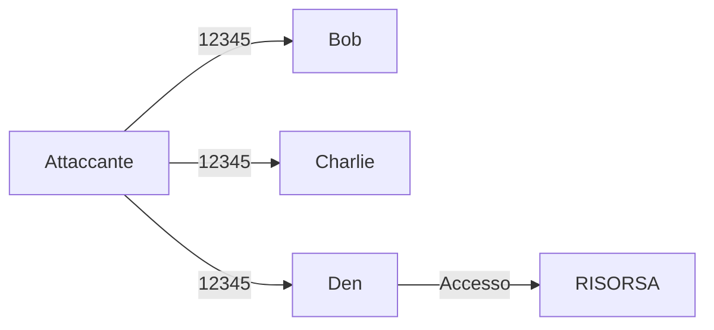

L'autenticazione utente è alla base dell'attività su Internet.
Consiste nel permettere solamente ad un utente autenticato, quindi la cui identitià è stata verificata, di accedere a servizi o informazioni specifiche.

L'autenticazione più semplice sicuramente è quella basata sulle password.
Ci sono altri tipi di autenticazione che non coinvolgono le password che stanno sempre più acquistando popolarità, come l'uso di un token o di un fattore biometrico.

L'autenticazione si può basare su uno o più fattori (più ne si usa meglio è):
- qualcosa che si sa (pwd)
- qualcosa che si possiede (auth key)
- qualcosa che si è (impronta digitale)
## Autenticazione Password
Le password sono ormai un grande tabù, non sono un metodo insicuro intrisecamente MA è l'uso che l'utente medio ne fa che lo rendono un metodo pericoloso.
Nella maggior parte dei casi le password inserite sono facili o riconducibili ad informazioni personali pubbliche.

Ci sono tantissimi modi per scovare una password:
- indovinare, magari cercando interessi, hobby, parenti, animali, eccetera
- spiare l'inserimento fisicamente ma anche virtualmente (keyloggers)
- forza bruta
- intercettazione del traffico --> crittografare il traffico
- phishing
- furto di info
- tutte le tecniche di ingegneria sociale
- eccetera...

Sia in Win che in Linux le password sono salvate sottoforma di hash (funzione non reversibile che associa ad ogni stringa una sequenza alfanumerica univoca).

Windows usa due tipi di hash per salvare le password sul sistema:
- LM - sistema di hashing adottato da windows, divide le password in blocchi di 7 caratteri e ne ricava gli hash che poi vengono combianti (viene fatto padding sui pezzi < 7), le pwd possono essere max 14 char; ormai è poco sicuro e sostituito da NTLM.
- NTLM - sistema di hashing che adotta windows, è più sicuro e permette l'uso di password più di 14 chars.

### Attacchi alle password
Una password può essere attaccata provando ogni combinazione: **Forza Bruta**.
Questa è la soluzione più dispendiosa dal punto di vista temporale, con una password lunga 8 e composta dalle sole lettere minuscole, le possibilità sarebbero:
$$26^8 = 208827064576$$
... nemmeno tante.

Si possono poi eseguire **attacchi con dizionario**, quindi provare a costruire la password basandosi però su parole esistenti e componendole con numeri o caratteri speciali.

Esistono anche delle **rainbow tables**, ovvero delle tabelle che contengono già password e rispettivo hash pre-calcolato.
Se si riesce a trafugare un db protetto semplicemente da hash, è possibile trovare qualche riscontro.

### Forza di una Password
Per misurare la bontà di un password è necessario misurare l'**entropia** della stessa. Una buona password possiede un entropia di almeno 60. Per calcolarla si una semplice formula:
$$e = log_2(|A|^n)$$
dove:
- $A$ è l'alfabeto
- $n$ è la lunghezza della pwd

### Contromisure
Per migliorare la sicurezza delle password lato "server" ci sono diversi modi:
- uso del sale per arricchire l'hash della password (c'è chi ci mette il pepe)
- controllo degli accessi ai file e db delle password
- obbligo di ri-generazione periodica

Per migliorare la sicurezza in generale:
- bloccare l'utente dopo troppi tentativi
- intervallo di tempo tra un tentativo e l'altro
- monitoraggio per individuare usi non comuni
- notificare il l'utente legittimo di eventuali tentativi di accesso
- controllare la creazione di una password

### Password spraying
Fenomeno per il quale una risorsa viene attaccata perché uno degli utenti che hanno accesso alla stessa possiede una password debole. Spesso si prova la stessa password su più utenti.

## Autenticazione Multi-Fattore
L'autenticazione multi-fattore mira ad aggiungere un grado di autenticazione nel processo, spesso viene utilizzata in combinazione con la password e può essere implementata in diversi modi:
- codice inviati per mail, sms o generati da un app specifica (detti OTP)
- security auth devices (USB keys)
- biometric authentication
- un app su un dispositivo fidato

Due metodi ampiamente usati per ottenere una password temporanea (OTP: one time password) sono:
- SMS-based (anche email ormai): viene inviato un codice tramite SMS o MAIL all'utente che necessita di accedere
- TOTP-based: viene associata un app che genera continuamente, nel tempo, codici OTP per quello specifico servizio (e.g. Google Authentication)
- HOTP-based: simile a TOTP ma i codici vengono generati in base ad un evento

### **HOTP vs TOPT**
HOTP è una procedura di creazione di OTP basata su un contatore.
1. Quando l'utente specifica di voler attivare la MFA, server e client si condividono una chiave segreta $K$
2. Il client inizializza anche un contatore $C$
3. Il client genera un hash usando HMAC:
$$HOPT(K, C) = HMAC.SHA1(K, C)$$
4. viene estratto un pezzo di hash generato $H$, $h$ sarà il codice OTP generato dal client:
$$h = H[n:m] \space con \space n < m$$
5. Il server segue lo stesso procedimento e genera $h'$, se $h = h'$ allora l'utente verrà autenticato. Il server incrementerà il contatore.

TOPT funziona praticamente nello stesso modo, l'unica differenza sta nel fatto che viene utilizzato un fattore temporale al posto del contatore $C$.
$$TOPT(K, T) = HMAC.SHA1(K, T)$$
In questo caso $T$, è generato in base al Current Unix Time $CUT$ (ovvero il tempo in secondi trascorso dal 1° gennaio 1970):
$$T = \frac{(CUT - T_0)}{X}$$
con
- $T_0$ - unix time da dove inizare a contare, lo teniamo a 0
- $X$ - intervallo in secondi

Esempio con $CUT = 1704468690$, $T_0 = 0$ ed $X = 60$:
$$T = (1704468690 - 0)/60 = 28407811.5$$
$T$ verrà usato per attichire l'hash da cui si estrarrà il codice opt.

### **Dati biometrici**
L'autenticazione attraverso dati biometrici si basa su una caratteristica umana: *qualcosa che si è*. Ogni caratteristica su cui si vuole basare il sistema di autenticazione deve rispettare quattro proprietà:
- **Universalità** - tutti gli essere umani sono dotati (almeno lo dovrebbero essere) della caratteristica biometrica che si vuole utilizzare
- **Distintività** - la caratteristica è unica per ogni essere umano
- **Permanenza** - la caratteristica deve rimanere anche nel corso del tempo
- **Collezionabilità** - la caratteristica deve avere la capacità di essere esaminata e quantificata

Esempi di caratteristiche possono essere:
- firma
- DNA
- impronta digitale
- voce
- faccia
- retina

L'impronta digitale, una volta analizzata, viene trasformata in un codice seriale. Quest'ultimo viene poi confrontato con quello immagazzinato in fase di inizializzazione per garantire o meno l'accesso.

Ovviamente questo metodo di autenticazione ha dei limiti:
- presenza, a volte, di falsi positivi o falsi negativi
- possibilità di riproduzione della caratteristica (impronta digitale lasciate in giro)
- negazione del consenso di analizzare la propria caratteristica dall'utente

