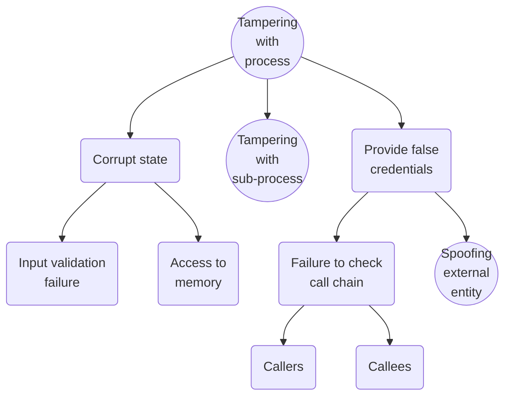

Il Threat Modeling raggruppa diversi processi di sicurezza relativi soprattutto alla creazione di un applicativo, basandosi sul concetto di **privacy by design**.
Questo processo viene adottato principalmente come misura proattiva durante le fasi di design e sviluppo di un prodotto per individuare:
- come un sistema o un servizio potrebbe essere attaccato
- le misure di controllo necessarie per gestire i rischi

Per fare ciò bisogna avere chiari diversi concetti:
- capire cosa si sta modellando
- capire chi interagisce
- quali sono le entità di cui ci si può fidare e non (detti trust boundaries)
- capire come ridurre al minimo i rischi

Il Threat Modeling è un processo continuo e deve essere integrato nel ciclo di vita dello sviluppo del software.

Esistono diversi metodi per utilizzare il Threat Modeling. Tra questi, il più popolare è **STRIDE**, creato da Microsoft, che riferisce a sei aspetti chiave da considerare durante il Threat Modeling: spoofing, manomissione, ripudio, divulgazione di informazioni, negazione del servizio ed elevazione dei privilegi.

Il processo di STRIDE segue quattro fasi che si ripetono nel tempo:
1. Creazione del Data Flows Diagrams
2. Identificazione delle minacce analizzando il diagramma costruito
3. Mitigazione dei rischi derivanti dalle possibili minacce
4. Validazione delle mitigazioni proposte

## Step 1 - Data Flows Diagrams (DFD)
Un DFD è una rappresentazione grafica che raccoglie entità e relazioni tra di esse, specificando:
- il flusso all'interno del sistema
- le sorgenti e le destinazioni dei dati
- tutti i processi rilevanti al fine di raggiungere l'obiettivo del sistema

I DFD sono rappresentazioni grafica e di conseguenza sono composte da elementi grafici che descrivono un'entità, ovvero:
- *`rettangoli`* - entità esterne (e.g. persone, altri sistemi)
- *`ovali`* - processi unitari (e.g. dll, exe, webservice)
- *`doppi ovali`* - gruppi di processi con scopo unico (e.g. il servizio di login è un elemento che si compone di tante funzioni, per semplicità lo rappresentiamo con il doppio ovale)
- *`frecce`* - flusso dei dati, tutto ciò che è comunicazione utente-processo o processo-processo (e.g. traffico di rete, chiamate a funzione)
- *`rettangolo senza altezze`* - datastore (e.g. database, files, registri, queue, stack, etc.)
- *`rettangolo/linea tratteggiata`* - confini affidabili (e.g. process boundaries, file system)

Ovviamente un DFD può assumere diversi livelli: dal più alto, quindi una rappresentazione molto astratta del sistema; al più basso, un rappresentazione dettagliata di ogni funzione o elemento che compone il sistema.

Quando si crea un DFD è buona norma iniziare da un diagramma molto astratto per poi scomporlo in ogni sua parte, evidenziando ogni rischio o minaccia a cui il sistema potrebbe essere soggetto.

## Step 2 - Identificazione delle Minacce
Ogni elemento, che compone il sistema, inserito all'interno del DFD deve essere analizzato relativamente alle minacce a cui potrebbe essere soggetto, STRIDE fornisce una guida alle minacce e alle relative proprietà che vengono compromesse:

| Minaccia |  | Proprietà | Descrizione |
| :--- | :--: | :--- | ---- |
| **S**poofing | --> | Authentication | Impersonificazione di qualcosa o di qualcuno |
| **T**ampering | --> | Integrity | Modifica di dati, informazioni o codice |
| **R**epudiation | --> | Nonrepudiation | Dichiarazione di non aver svolto una determinata azione |
| **I**nformation Disclosure | --> | Confidentiality | Esposizione di info a qualcuno che non è autorizzato ad averle |
| **D**enial of Service | --> | Availability | Negazione o degradazione dei servizi utente |
| **E**levation of Privilege | --> | Authorization | Ottenimento di privilegi amministrativi senza autorizzazione (bypass dell'access control) |
Guarda un po' ci sono [[I Sei Pilastri]].

Ogni elemento definito da STRIDE può essere mappato su un elemento grafico fornito dai DFD, fornendo così informazioni relative a quali minacce possono essere soggetti i vari elementi:

| Elemento | **S**poofing | **T**ampering | **R**epudiation | **I**nformation Disclosure | **D**enial of Service | **E**levation of Privilege |
| :--: | :--: | :--: | :--: | :--: | :--: | ---- |
| Entità Esterna | :IbCheck: |  | :IbCheck: |  |  |  |
| Processo | :IbCheck: | :IbCheck: | :IbCheck: | :IbCheck: | :IbCheck: | :IbCheck: |
| Datastore |  | :IbCheck: | ❔$^1$ | :IbCheck: | :IbCheck: |  |
| Flusso Dati |  | :IbCheck: |  | :IbCheck: | :IbCheck: |  |

$^1$: nel caso in cui i log venissero modificati

Ovviamente la tabella sopra riportata resta indicativa e generale, ogni volta che si analizza un elemento del DFD è necessario analizzare e capire quali sono, effettivamente, le minacce.

Una volta compilata la tabella per ogni elemento è necessario approfondire ogni minaccia, costruendo, di fatto, un albero che specifica ogni tipo di rischio in modo tecnico.

Viene quindi composto uno ==scenario completo rispetto alla minaccia generale== identificata nella tabella.

Facciamo un esempio relativo al tampering con un processo  (ma ce ne sono molti s
ulle slides):

Ogni nodo foglia rappresenta un possibile richio che deve essere valutato, analizzato e mitigato.
Ogni cerchio rappresenta una super-minaccia (perché comprende altri scenari).

Dopo aver stilato l'albero completo di ogni super-minaccia rispetto ad ogni elemento del nostro sistema (quindi sì è un bel lavorone, proporzionato alla gradenzza del sistema) si fa necessario attuare un'analisi dei rischi per eseguire una priorizzazione.

L'analisi dei rischi si esegue confrontando *likelihood* e *impact*, nelle modalità descritte in [[Cyber Risk Management]].

STRIDE offre una categorizzazione dei rischi in base a quattro possibili livelli (da 1 il più alto a 4 il più basso):
1. **very high** - deve essere gestito nella fase di sviluppo, immediatamente
2. **high** - deve essere gestito durante la fse di sviluppo
3. **medium** - deve essere gestito prima della release
4. **low** - gestito solo se il tempo lo permette

Microsoft SDL (Security Development Lifecycle) è un insieme di pratiche e requisiti per lo sviluppo **sicuro** del software.

Ogni sua fase ha bisogno di specificare una cosiddetta *bug bar*, ovvero una classificazione delle minacce basata sull'impatto che esse hanno sul sistema.

## Step 3 - Piano di Mitigazione
Una volta che le minacce sono state scoperte, analizzate e categorizzate dalle fasi precedenti è possibile stabilire quali mitigazione sono applicabili.

STRIDE specifica quattro possibilità:
- Non fare nulla
- Rimuovere la funzionalità sorgente di rischio
- Accettare la vulnerabilità by design
- Contrastare la minaccia attraverso la tecnologia specifica

STRIDE approfondisce le tecniche di gestione per ogni minaccia che rappresenta:

| Minaccia | Proprietà | Tecniche di Mitigazione |
| :--- | :--- | ---- |
| **S**poofing | Authentication | MFA, Kerberos auth, PKI systems (e.g. SSL, TLS), IPSec, Hashes |
| **T**ampering | Integrity | Windows Vista, ACLs (access control list), digital signature |
| **R**epudiation | Nonrepudiation | String auth, secure logging and auditing, digital signature, secure timestamps |
| **I**nformation Disclosure | Confidentiality | Encryption e ACLs |
| **D**enial of Service | Availability | ACLs, filtering, authorization mechanisms, |
| **E**levation of Privilege | Authorization | ACLs, group or role membership, privilege ownership, permissions, input validation and sanification |

## Step 4 - Validazione dei Threat Models
Infine l'intero modello di analisi e gestione viene validato controllando che ogni suo componente sia valido ed esaustivo.