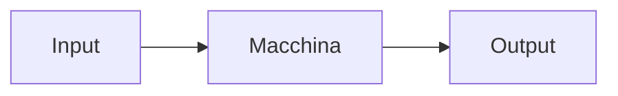

I problemi possono essere risolti riducendo il problema a problemi (modelli) già risolti. Un modello restituisce una metodologia risolutiva standard ad un problema ben specifico.

La complessità è la disciplina più astratta, in realtà è la capacità di riconoscere i modelli.

Quindi per risolvere un problema possiamo:
- ridurre il problema ad un modello
- riduzione attraverso induzione matematica a sotto-problemi (ricorsione)

Lo strumento fondamentale è la matematica discreta.


In input ed output abbiamo un numero, nello specifico numeri discreti (naturali).
La macchina stessa DEVE avere una descrizione finita, quindi lei stessa appartiene ai numeri naturali (vedere Turing).

La macchina è universale che viene, a tutti gli effetti, data in input dalla descrizione.
==La descrizione corrisponde all'algoritmo.==

L'algoritmo è una sequenza finita di istruzioni, esso ha lo scopo di risolvere un determinato problema.

L'ambizione più alta è quella di riconoscere i linguaggi, ma essi sono tanti quanti i possibili insieme delle stringhe, **infinito**. Quindi non può esistere una macchina per ogni possibile linguaggio perché è possibile scrivere solo un numero numerabili di linguaggi (algoritmi).

Turing e Church riescono a costruire il primo problema di indecidibilità e ciò si propaga, dando vita alle teorie di indecibilità.

## Problema: piastrelle
Prima di tutto è necessario **capire** il problema lasciando da parte l'algoritmo in sé. Bisogna costruirsi interiormente un processo ragionando sulla natura del problema.

Cominciamo con la tabella:

| n   | f(n) |
| --- | ---- |
| 1   | 1    |
| 2   | 2    |
| 3   | 3    |
| 4   | 5    |
| 5   | 7    |
Con $n=3$ allora:
```t
[][][]
[][--]
[--][]
```

Subito si potrebbe pensare che $f(n) = n$. Però andiamo avanti, come raggiungiamo l'*infinito*? Ovviamente ==induzione matematica==!

---

Studiamo una funzione più facile, ovvero quella restituisce la somma dei primi $\texttt{n}$ numeri dispari:

| n   | disp(n) | $\sum$(n)                                   |
| --- | ------- | ------------------------------------------- |
| 1   | 1       | 1                                           |
| 2   | 3       | 1+3=4                                       |
| 3   | 5       | 1+3+5=4+5=9                                 |
| 4   | 7       | 1+3+5+7=9+7=16                              |
| ... | ...     | ...                                         |
| n   | disp(n) | $\sum(n)$ = $\sum(n-1)$ + $disp(n)$ = $n^2$ |
Non posso verificarne una per una (sono infinite), quindi bisogna utilizzare un metodo: induzione.

**Base**
$\sum(1) = 1 = 1^2$

Vogliamo dimostrare che $\sum(n + 1) = (n + 1)^2$. Quindi lo prendiamo per vero e la vediamo come l'ipotesi induttiva.

Obiettivo: ridurre un problema ad un altro:
$$\sum(n+1) = \sum(n) + disp(n + 1) =\texttt{(i.i.)} = (n+1)^2$$
sapendo che:
$$disp(n) = 2n - 1 \implies disp(n+1) = 2(n+1)-1 = 2n + 1$$
Quindi:
$$\sum(n+1) = \sum(n) + disp(n + 1) = n^2 + 2n + 1 = (n+1)^2$$

---

Grazie a questo esempio possiamo aspettarci una crescita esponenziale nel problema delle piastrelle.

Le scelte sono riconducibili a $2^{\frac{n}{2}}$.

| n   | f(n) |
| --- | ---- |
| 1   | 1    |
| 2   | 2    |
| 3   | 3    |
| 4   | 5    |
| 5   | 8    |
Mettiamo che facciamo il controllo brute-force su $n=4$ allora devo fare:
$$\frac{n(n-1)}{2}$$
controlli, quindi ho un numero quadratico, tendente a $n^2$.

Mentre $n=5$ allora $f(n) = 8$:
```t
[][][][][]
[][][][--]
[][--][][]
[][][--][]
[--][][][]
[][--][--]
[--][--][]
[--][][--]
```

L'ordine permette di inserire coerenza e di disambiguare gli esempi e le soluzioni.

Si potrebbe ragionare su quali piastrelle vanno inserite prima, magari proviamo ad inserire prima le piastrelle da singola unità:
```t
[][][][]
[][][--]
[][--][]
[--][][]
[--][--]
```

Esaminando il problema in questo modo è possibile individuare una **ricorrenza**.

---
<small>Mercoledì 6 marzo 2024</small>

Continuazione problema

Riprendiamo il problema dell'altra volta, INTUIZIONE: **sembra rispettare la sequenza di fibonacci**!
$$f(n) = f(n-1) + f(n-2)$$

Esistono repository apposta per cercare info sui risultati (nello specifico sequenze di numeri), tipo Sloane Sequence Repository (rif.: https://oeis.org/).

Ovviamente bisogna applicare la soluzione di Fibonacci al problema, possiamo esaminare per pattern matching.

Posso contare le piastrellature che iniziano con piastrella da 1 oppure da 2, in questo modo posso capire che **se inizio con la piastrella da 1 sto poi lavorando su N-1 spazi vuoti**.

(Guarda codice nella cartella del laboratorio)

Una volta trovata la soluzione numerica è necessario stampare le diverse possibilità di piastrellanza.

---
<small>Mercoledì 13 marzo 2024</small>
PDF di Stini


