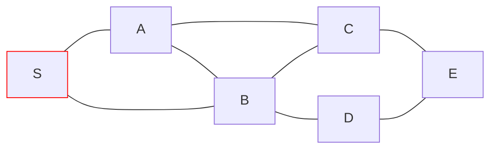

Come sempre un grafo è definito da $G=(V,E)$.

Un grafo si dice <span style="color:#00b050">semplice</span> se non presenta cicli e non presenta nodi paralleli.

Definisco la relazione $\thicksim$:
$$u \thicksim v \Leftrightarrow \exists (u \leadsto v) $$
Quindi esista la relazione $u \thicksim v$ sse esiste un cammino che va da $u$ a $v$.
Proprietà:
1. riflessiva - $\forall v \in V.v \thicksim v$
2. simmetrica (in un grafo non diretto) - $u \thicksim v \Leftrightarrow v \thicksim u$
3. transitiva - $u \thicksim v \wedge v \thicksim z \implies u \thicksim z$

Le componenti connesse di G sono le classi della relazione di equivalenza.

==Un grafo G si dice connesso se ha una sola componente connessa.==

> In [teoria dei grafi](https://it.wikipedia.org/wiki/Teoria_dei_grafi "Teoria dei grafi"), un [grafo](https://it.wikipedia.org/wiki/Grafo "Grafo") G = (V, E) è detto **connesso** se, per ogni coppia di vertici (u, v) ∈ V, esiste un cammino che collega u a v.

## Come capire se un grafo G è connesso?
Abbiamo due modi per visitare il grafo: **BFS** (Breadth First Search) e **DFS**.
Entrambi sono algoritmi di ricerca.

**BFS** - esegue la ricerca "in parallelo" sui nodi allo stesso livello, sulla profondità del grafo rispetto al nodo di partenza della ricerca.

La chiave di questo algoritmo l'utilizzo di una coda, "queue", in modalità FIFO.
Quindi la priorità della coda viene data all'ampiezza.

```python
# inizializzazione
queue = deque()
dist = [+inf for v in V]
father = [None for v in V]

# nodo di inizio
father[S] = S
dist[S] = 0
queue.push(S)

while queue is not empty:
	v = queue.pop()
	# scorre ogni cammino unitario relativo a v
	for v, z in E:
		if dist[z] == +inf:
			dist[z] = dist[v] + 1
			father[z] = v
			queue.push(z)
			
```

Questo pseudo-algoritmo ha complessità $O(n + m)$, meglio dire $O(|V| + |E|)$.
Possiamo capire che tale problema è in NP.

La coda FIFO che verrà utilizzata è detta bi-monotona perché quando pesco dalla coda verranno generati altri elementi a distanza incrementata di 1.
Quando termino la coda sarà vuota, come all'inizio.

Se prendo l'esempio sottostante, la coda segue questo andamento:
0. {}
1. {S}
2. {A, B}
3. {B, C}
4. {C, D}
5. {D, E}
6. {E} (in realtà non apparirà mai così perché non entra nel ciclo for, dato che E è l'ultimo elemento)
7. {}

---

Vediamo un esempio, partendo da S (poca sbatta da scrivere, vedere [qui](https://www.geeksforgeeks.org/breadth-first-search-or-bfs-for-a-graph/))


V = {S, A, B, C, D, E}
E = {(S,A), (S, B), (A, B), (A, C), (B, C), (B, D), (C, E), (D, E)}

ChatGPT ne sa a quanto pare (88):
1. **Inizializzazione**: Partiamo dal nodo iniziale (S) e lo aggiungiamo alla coda.
2. **Espansione dei nodi adiacenti**: Estraiamo il primo nodo dalla coda e aggiungiamo tutti i suoi nodi adiacenti alla coda, se non sono già stati visitati.
3. **Ripeti fino a quando la coda è vuota**: Continuiamo ad estrarre nodi dalla coda e ad aggiungere i loro nodi adiacenti fino a quando non abbiamo visitato tutti i nodi raggiungibili.

Ecco come procedere con la BFS:

1. Partiamo dal nodo iniziale S e lo aggiungiamo alla coda:
    
    Coda: [S] Visitati: {S}
    
2. Estraiamo il primo nodo dalla coda (S) e aggiungiamo i suoi nodi adiacenti alla coda (A, B), poiché non sono stati visitati:
    
    Coda: [A, B] Visitati: {S, A, B}
    
3. Estraiamo il nodo successivo dalla coda (A) e aggiungiamo i suoi nodi adiacenti alla coda (B, C), poiché non sono stati visitati:
    
    Coda: [B, C] Visitati: {S, A, B, C}
    
4. Estraiamo il nodo successivo dalla coda (B) e aggiungiamo i suoi nodi adiacenti alla coda (C, D), poiché non sono stati visitati:
    
    Coda: [C, D] Visitati: {S, A, B, C, D}
    
5. Estraiamo il nodo successivo dalla coda (C) e aggiungiamo il suo nodo adiacente alla coda (E), poiché non è stato visitato:
    
    Coda: [D, E] Visitati: {S, A, B, C, D, E}
    
6. Estraiamo l'ultimo nodo dalla coda (D) e non ci sono più nodi adiacenti non visitati, quindi il processo termina.
    

Quindi, l'ordine di visita dei nodi usando la BFS è: S, A, B, C, D, E.

---

