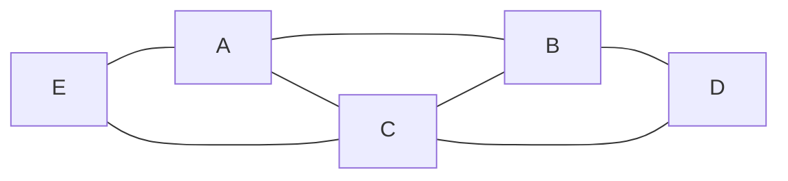
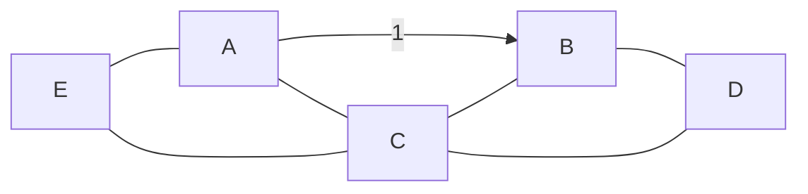
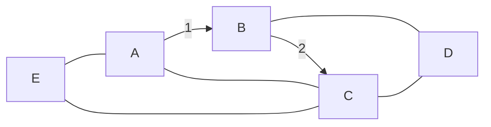
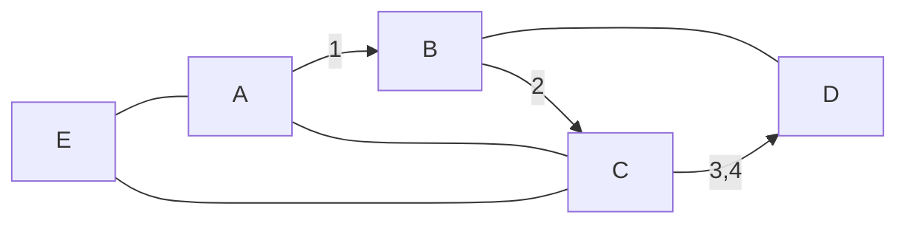
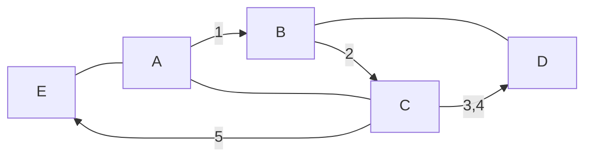
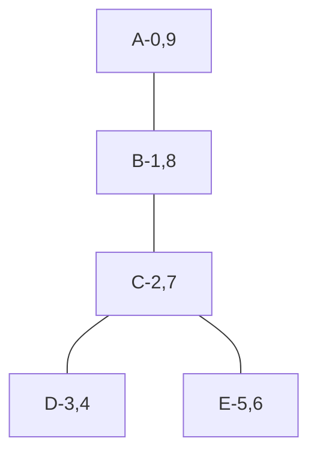

Supponiamo di avere un grafo:

Ed un nodo di partenza che in questo caso è `A`. Tale nodo è di grado 3: ad esso sono collegati 3 archi.

Scegliamo un arco dei tre ed andiamo su `B`, su cui non sono mai stato (come a Napoli, tanto meno in moto):

Segnaliamo `B` come visitato e andiamo su `C`.

Ovviamente, ogni nodo già visitato non può essere ri-visitato perché il nostro algoritmo deve essere finito.

Da `C` posso o andare in `D` oppure andare in `E`:

Rimane utile tenere traccia, per ogni nodo, del predecessore:
$$\texttt{[None->A, B->A, B->C, C->D]}$$
`D` non può proseguire, perché tutti i nodi attorno a lui sono stati già visitati.
Però, in ordine contrario di visita, possiamo andare da `C` ad `E`:

Da `E` non posso più visitare nodi nuovi. Ora, tutti i nodi si chiuderanno perché non esistono più nodi adiacenti, indico dopo la virgola l'istante in cui si chiudono i nodi.

Possiamo creare il seguente spanning tree DFS:

Ogni nodo ha un tempo di vita, ovvero un $\Delta$ per il quale il nodo è "attivo". Li indico sull'albero.

