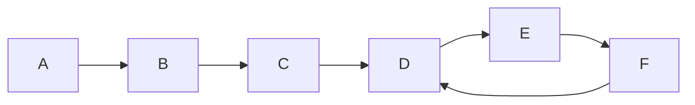

## Proseguimento di `list_alignment`

Vedere [[27_05_2024-tutor-algoritmi]]

Il primo metodo per risolverlo è un'approccio top-down.
Vogliamo ritornare il valore massimo ottenibile, togliendo elementi nel range `U[iu:], D[id:]`

```python
def ric_sol(U, D, iu, id):
	# caso base
	if len(U) - iu == 0:
		return 0
	elif len(D) - id == 0:
		return 0

	# prima possibilità
	caso1 = ric_sol(U, D, iu + 1, id) + 0
	# seconda possibilità
	caso2 = ric_sol(U, D, iu, id + 1) + 0
	# terza possibilità
	caso3 = ric_sol(U, D, iu + 1, id + 1) + min(U[iu], D[id])

	return max(caso1, max(caso2, caso3))
```

Abbiamo tre possibilità:
- rimuovo un elemento da `U` continuo
- rimuovo un elemento da `D` e continuo
- considero `U[iu], D[id]` come un match (come se condividano lo stesso indice) ed aggiungo il valore ottenuto dalla soluzione

Questa soluzione fa schifo al cazzo perché ogni volta chiama tre elementi e quindi la complessità è $O(3^{|U| + |D|})$. Quindi è esponenziale.

Dobbiamo trovare un modo per velocizzarla -> **prog. dinamica** con memoizzazione.

Bisogna implementare una matrice indicizzata per gli argomenti che vogliamo salvare, in questo caso è utile farlo solo su `iu` e `id` perchè gli array sono sempre quelli.

```python
# id può andare solo fino a len(D) e iu fino a len(U)
M = [ [None for _ in range(len(D) + 1)] for _ in range(len(U) + 1)]

# funzione top-down, prog. dinamica
def ric_sol(M, U, D, iu, id):
	# caso base
	if M[iu][id] is not None:
		return M[iu][id]
		
	if len(U) - iu == 0:
		return 0
	elif len(D) - id == 0:
		return 0

	# prima possibilità
	caso1 = ric_sol(U, D, iu + 1, id) + 0
	# seconda possibilità
	caso2 = ric_sol(U, D, iu, id + 1) + 0
	# terza possibilità
	caso3 = ric_sol(U, D, iu + 1, id + 1) + min(U[iu], D[id])

	sol = max(caso1, max(caso2, caso3))
	M[iu][id] = sol
	return 
```

In questo caso la complessità si abbassa di non so cosa dioboia


La versione bottom-up permette di trasformare la versione ricorsiva ad iterativa e di velocizzare i tempi.

```python
def iter_sol(U, D):
	M = [ [0 for _ in range(len(D) + 1)] for _ in range(len(U) + 1)]

	for iu in reversed(range(len(U) + 1)):
		for id in reversed(range(len(D) + 1)):
			# caso 1: rimuovo da U
			caso1 = M[iu + 1][id] + 0 # costo invariato
			# caso 2: rimuovo da D
			caso2 = M[iu][id + 1] + 0
			# caso 3
			caso3 = M[iu + 1][id + 1] + sol min(U[iu], D[id])

			M[iu][id] = max(caso1, max(caso2, caso3))

	return M[0][0]
```

La soluzione sarà all'inizio per il fatto che iniziamo dalla fine.

C'è anche la possibilità di usare una matrice più piccola:
```python
M = [ [0 for _ in range(len(D) + 1)] for _ in range(2)]

for iu in reversed(range(len(U) + 1)):
		for id in reversed(range(len(D) + 1)):
			# caso 1: rimuovo da U
			caso1 = M[(iu + 1) % 2][id] + 0 # costo invariato
			# caso 2: rimuovo da D
			caso2 = M[iu % 2][id + 1] + 0
			# caso 3
			caso3 = M[(iu + 1) % 2][id + 1] + min(U[iu % 2], D[id])

			M[iu % 2][id] = max(caso1, max(caso2, caso3))

	return M[0][0]
```

In questo modo viene occupata memoria lineare.

---

# Problema `odd_cycle_reach`

Abbiamo un grafo non orientato ed è necessario stabilire da quali nodi è possibile raggiungere un ciclo di lunghezza dispari:




Tale problema è molto simile a Tecla, ma chiede se è possibile raggiungere un ciclo dispari da OGNI nodo.

La prima cosa è trovare un ciclo dispari, se trovato possiamo prendere tutta la componente connessa (con DFS) e successivamente ritornare True se c'è un ciclo dispari.

Come si fa a vedere se c'è un ciclo dispari?
- partiamo da un nodo e lo coloriamo di bianco
- visito e coloro di nero
- e proseguo in modo alternato

Quando arrivo ad un nodo già visitato controllo il colore che possiede e il colore che dovrei assegnare, se sono uguali allora non esiste un ciclo dispari.

Se tutti i branch hanno ritornato False ritorna False ricorsivamente.

```python

V = [None for _ in range(N)]
sol = []

for i in range(N):
	if V[i] is None:
		C = []
		found_odd_cycle = dfs_cycle(L, V, C, i, "white")
		if found_odd_cycle:
			sol += C
sol.sort()


def dfs_cycle(l, V, C, n, color) -> bool:
	if V[n] is not None:
		if  V[n] == color:
			# nessun ciclo dispari
			return False
		else:
			return True

	V[n] = color
	new_color = "black" if color == "white" else "white"
	found = False
	C.append(n) # aggiungiamo il nuovo elemento

	for x in L[n]:
		found |= dfs_cycle(L, V, C, x, color)
	return found
```

---

Poi ha fatto piastrelle ma mi sono rotto i coglioni di ascoltare sto matto scatenato.
