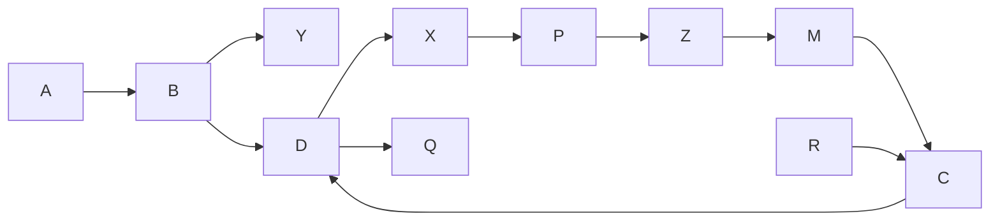
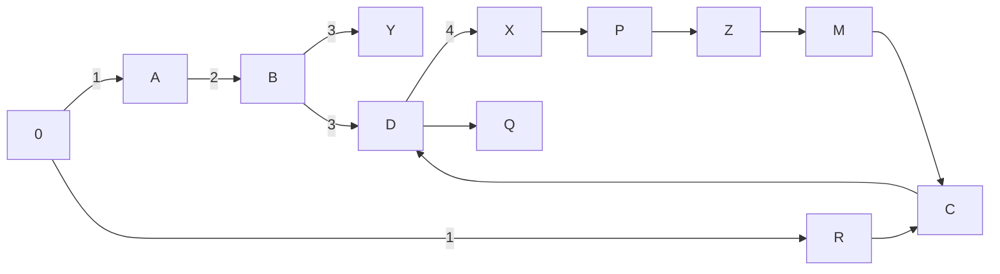
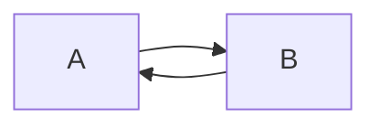

Fino ad ora abbiamo sempre lavorato sulle linee, guardiamo la prog. din. su altre strutture.

**Problema**
Definiamo un ordine attraverso tale grafo diretto $G$:

Il problema consiste nel dare un ordine a tutte le attività rispettando le precedenze, è effettivamente un problema di scheduling con precedenze binarie: **ordinamento topologico**.

Nel grafo ogni nodo rappresenta un'attività.

Questo problema nasce in NP, perché verificare, dato un ordine, è polinomiale.
Noi vogliamo, quando l'algoritmo termina, ottenere una risposta `sì` oppure `no`. Quindi è giusto far ricadere il negato del problema in Co-NP.

Il problema nasce nei cicli, quando c'è un ciclo, allora il verificare finisce in deadlock, in un ciclo infinito.

**I approccio: BFS**
Aggiungo un nodo iniziale $\emptyset$ ed inserisco le profondità da questo specifico nodo:

Assumiamo che sia sempre vero che si possa mettere i nodi in ordine, però è subito smentita dalla possibilità di esistenza di porzioni del genere:

Nel caso riportato sopra abbiamo un ciclo diretto $C \leadsto C$.

Quindi:
Ogni grafo è schedulabile a meno che non contenga un ciclo diretto

