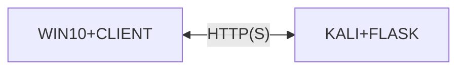

L'idea è quella i creare un malware che cattura i tasti premuti dall'utente e li invia ad un server su una macchina virtuale.
Quindi rete NAT tra macchina windows vittima e kali.



## Keylogger Client
Il client va costruito su un ambiente windows, si può buildare in exe con due diversi software:
- nuitka
- pyinstaller

Entrambi producono un file exe funzionante ma con console a vista :\

Se si imposta il flag per non mostrare la console defender individua il programma come malevolo, anche a seguito di offuscamento (link sotto).
==Sembra che il problema derivi da il fatto che viene fatta una richiesta POST verso un indirizzo di rete. Infatti buildare il programma senza console e con la request commentata non genera problemi.==

Bisogna pensare l'attacco per una macchina nuova, l'unico programma installato in più è Word, necessario per gestire le macro. Non ci deve essere python.
Meglio scrivere lo script e testarlo direttamente su una macchina windows analoga a quella pulita che verrà utilizzata.

Comando per nuitka per la compilazione:
```bash
python -m nuitka --mingw64 --standalone --onefile --windows-disable-console <file.py>
```

Possibilità interessanti:
[python - exe file made with pyinstaller being reported as a virus threat by windows defender - Stack Overflow](https://stackoverflow.com/questions/64788656/exe-file-made-with-pyinstaller-being-reported-as-a-virus-threat-by-windows-defen)

Nemmeno con pyarmor funzionava nulla.

---

*Oggi, in data 8 gennaio 2024*

Dato che le soluzioni in python non hanno portato frutti, ho provato utilizzando C#.

Prima di tutto ho provato un offuscatore chiamato Alcatraz, ma non sono riuscito a far funzionare l'exe che mi produceva.

Successivamente ho provato Eaxfuscator, utilizzando .NET 8.0 e pubblicando l'eseguibile come file standalone.
Ho provato con del codice di mockup che non faceva altro che inviare un contatore incrementale ogni 10 secondi ad un server beeceptor, ora devo provare a creare il keylogger sfruttando le API di Windows.

Il passaggio dell'eseguibile offuscato non ha rilevato problemi da windows defender.

**GRANDE DISCLAIMER**, non è un keylogger quindi magari non viene identificato per quello.

---

*Oggi, 9 gennaio 2024*

Ho creato il keylogger in C# sfruttando le API di Windows e caricato sulla repo online.

Ho compilato due eseguibili:
- uno senza offuscamento
- uno con offuscamento, usando eazobfuscator

Quello senza offuscamento viene rilevato e rimosso da Windows Defender.

==Mentre quello con affuscamento SEMBRA funzionare.==

---

## Keylogger Server
Il server può essere fatto con flask, alla fine non fa altro che mostrare il testo catturato e ricevuto dal keylogger client.

L'dea è quella di usare HTTP (magari con ssl e quindi HTTPS, con un certificato non verificato creato internamente) per ricevere i dati dal client.

Magari usare docker per deployarlo più velocemente ma vediamo.

---

*Oggi, 14 febbraio 2024*

Purtroppo Eazfuscator fa scadere la licenza. Quindi ho trovato tale alternativa: [obfuscar](https://github.com/obfuscar/obfuscar).
Ho offuscato l'eseguibile stand-alone seguendo questo issue: [Is it supports .NET 5 single file exe? · Issue #314 · obfuscar/obfuscar (github.com)](https://github.com/obfuscar/obfuscar/issues/314).

(Con le opportune modifiche rispetto alle versioni nuove)

Score su virus total: 3/~60.

Inoltre ho creato un server flask che riceve richieste POST e salva il log in un file di testo.


