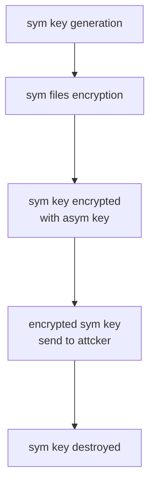

La parola *Malware* è ovviamente una sincrasi tra *Malicious* e *Software*. Tale esprime perfettament la natura di un malware, ovvero un software creato a scopi malevoli.

Più nel dettaglio un malware è un software (o un firmware) creato con lo scopo di andare a bucare uno de [[i-sei-pilastri]], questo ovviamente può portare al furto di dati, all'accesso non autorizzato e chi più ne ha più ne metta.

Un malware può essere iniettato in una macchina in diversi modi:
- fisicamente, magari tramite USB
- attraverso tecniche di social engineering
- attraverso mail di phishing
- scaricando materiale non sicuro sulla rete

Ci sono molteplici tipi di malware, ognuno con caratteristiche diverse.

## Virus
I virus sono una tipologia di malware che hanno bisogno di un eseguibile per infettare una macchina, quando un eseguibile infetto viene avviato il virus si propaga sulla macchina.
Ha, quindi, bisogno dell'azione umana per essere avviato, può causare danni come distruzione di dati o controllo del sistema vittima.
Un esempio di virus può essere un file all'interno del quale è stata programmata una macro malevola, capace di eseguire codice non sicuro.

## Worms
A differenza dei virus i worms possono propagarsi e riprodursi senza bisogno dell'azione umana. Spesso si possono diffondere sulla rete da dispositivo a dispositivo sfruttando le vulnerabilità o le scarse configurazioni dei sistemi utilizzati.

## Spyware
Gli spyware sono malware in grado di "spiare" l'utente. Per farlo raccolgono informazioni sull'utente senza averne il consenso. Ci sono diversi tipi di spyware, uno fra tanti il keylogger, un software malevolo in grado di registrare i tasti premuti dell'utente e di inviarli ad una macchina malevola.

## Trojan
Un trojan è un software che si presenta benevolo ma che nasconde delle funzionalità malevole.
Questi malware hanno lo scopo di creare una backdoor per avere accesso ad informazioni private o per controllare direttamente la macchina della vittima.
Possono avere origini differenti:
- da webserver infetti attraverso un attacco precedentemente avvenuto (e.g. software di trading deprecato)
- vulnerabilità nel sistema operativo oppure nei software di produttività
- phishing generico o documenti infetti (e.g. macro di word)

Un *RAT (Remote Access Trojan)* è un tipo di trojan che permette all'attaccante di instaurare un canale di accesso remoto sulla macchina vittima attraverso un server di C2.
Sono malware spesso molto complessi che mettono a disposizione tantissimi modi per eseguire azioni malevole.

## Rootkit
Un rootkit è un malware che si colloca in profondità nel sistema operativo, spesso a tal punto da complicare di molto la sua rimozione.
Lo scopo di un rootkit è quello di garantire la persistenza di altri malware sulla macchina della vittima, cercando di nascondere la presenza degli altri software malevoli.

## Botnet
Una botnet non è di per sé un malware. Nello specifico essa è una rete composta da macchine infette controllate da un unico dispositivo malevolo detto botmaster.
Ogni macchina infetta sulla rete è detta bot e vengono utilizzate nel loro insieme per attacchi DDoS o per campagne di spam/phishing.

## Cryptominer
I cryptominers sono malware che hanno l'obiettivo di minare silenziosamente criptovalute sfruttando le risorse della macchina malevola e di inviare i ricavi sul wallet dell'attaccante.

## Ransomware
I ransomware sono malware che permettono di criptare le informazioni su disco della macchina vittima.
Questo con l'obiettivo, spesso, di chiedere un riscatto economico.
In realtà ci sono svariati tipi di ransomware:
- lockers: bloccano l'accesso al computer
- master boot record: ovvero un ransomware che aggredisce la parte di disco dedicata all'avvio del sistema (MBR in realtà ormai è una tecnologia un po' datata, si usa GPT per i sistemi UEFI)
- wipers: mira a distruggere in modo permanente i dati all'interno del computer, senza possibilità di ripristino degli stessi
Un ransomware è formato da degli elementi fissi che lo caratterizzano (detti building blocks), di solito sono:
- comportamento trojan-like, quindi spesso sono sottoforma di software sicuri
- comprende routine di criptaggio e decriptaggio per i file
- interfaccia utente per permettere la comunicazione attaccante-vittima
Spesso la crittografia all'interno di un ransomware si basa su due livelli:
1. crittografia *simmetrica* *per i file*
2. crittografia *asimmetrica* *sulla chiave* usata dalla procedura di crittografia simmetrica

Flow della fase di encryption di un malware:

Fondamentale sottolineare come un malware complesso comprenda diverse tipologia di software malevolo, questo per cercare sempre di più di bypassare i sistemi di sicurezza.

Ci sono innumerevoli altre tipologie di malware, ognuno con metodi, scopi e modalità differenti. Ormai l'unico limite è la fantasia 😛

## Kill Switch
Uno kill switch è sostanzialmente un bottone di spegnimento immediato del malware creato dagli attaccanti per evitare di infettare la propria macchina.
Se un attaccante dimentica di eliminare il kill switch, esso potrebbe essere scoperto e ciò porterebbe alla disattivazione del ransomware (e.g. WannaCry kill switch).

# Prevenzione, Rilevamento ed Eliminazione
Un malware rappresenta un problema (spesso grave) e quindi è necessario porgere una certa attenzione.
Ovviamente esistono tecniche che permettono di prevenire, rilevare ed, in caso, eliminare minacce derivanti dai malware.

Per prevenire il deliver di un malware è necessario mettere in pratica tecniche per evitare di ricevere ed eseguire involontariamente software malevolo:
- filtri sulle mail
- impostare proxies per evitare il triaffico su siti malevoli noti
- protocolli che permettono di analizzare il traffico di rete
- uso di antivirus per l'analisi del software
- configurazione di firewall
- disabilitare l'esecuzione delle macro in automatico
- uso di credenziali sicure per gli utenti
- zero trust, quindi rendere temporanei i priviliegi per chi li ottiene
- aggiornamento delle macchine
- anche istruire il personale fa parte della prevenzione

Il modo più intelligente di pensare non è chiedersi "se mi bucheranno" ma "quando mi bucheranno". Quindi si rende necessario eseguire backups o implementare altri metodi per rendere ridondanti e sicuri i dati.

Per cercare di rilevare un malware è necessario usare un antivirus, ovvero un software in grado di analizzare la semantica dei programmi in esecuzione per capire se il comportamento è malevolo oppure no.

Se un'organizzazione viene infettata, allora bisogna rispondere tempestivamente, innanzi tutto scollegando tutte le macchine dalla rete.
Successivamente bisognerà compiere delle analisi per capire dov'è, come risolvere e come prevenire il problema.
Spesso si rende necessario re-installare i sistemi operativi sulle macchine al fine di essere sicuri di aver pulito.

