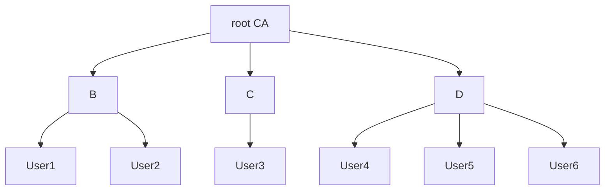

La sicurezza di una comunicazione crittografata dipende dalla segretezza delle chiavi, quindi è necessario utilizzare un sistema di gestione delle chiavi adeguato.

# Cryptographic Key Management

> [!info] Cryptographic Key Management
> Insieme di processi, protocolli ed attività utente atte alla gestione ed amministrazione delle chiavi di un sistema crittografico.

Comprende la generazione, protezione, ***distribuzione*** ed uso delle chiavi.
==La sicurezza di un sistema crittografico dipende dal sistema che gestisce le chiavi.==

## Symmetric Key Distribution
Per fare in modo che un sistema crittografico simmetrico funzioni tra due host è necessario condividere la stessa chiave.

Una tecnica di distribuzione è considerata adeguata se:
- la condivisione delle chiavi è privata verso i soli host coinvolti
- gli aggiornamenti di chiavi sono frequenti

La distribuzione delle chiavi simmetriche può essere implementata sia attraverso crittografia simmetrica sia attraverso quella asimmetrica.

### Using Symmetric Cryptography
Date due entità `A` e `B` esistono diverse possibilità di distribuzione delle chiavi simmetriche:
1. trasferimento fisico diretto tra `A` e `B`
2. trasferimento fisico mediante entità di terze parti `C`
3. trasferimento virtuale della chiave nuova diretto tra `A` e `B`, crittografando con la chiave precedente
4. trasferimento virtuale della chiave nuova mediante entità di terze parti `C`
Le prime due opzioni coinvolgono un trasferimento fisico e quindi sono utili solo in casi specifici, su Internet è un metodo inutilizzabile.

Diventa fondamentale, quindi, gestire delle entità di terze parti, dette **Key Distribution Centers** (KDC).

> [!info] Key Distribution Center
> Entità terza che genera o/e distribuisce le chiavi simmetriche di sessione per permettere la comunicazione sicura tra altre due entità

Nello specifico, il KDC, può operare in due modalità:
1. *modalità di traduzione* -> **la chiave di sessione $K_s$ è generata da `A`**, il `KDC` non farà altro che inoltrare a `B` la chiave (il `KDC` potrebbe anche relegare ad `A` il compito di fare il forward)
2. *modalità di distribuzione* -> **la chiave di sessione $K_s$ è generata da il `KDC`** a seguito di una richiesta specifica:
	1. il `KDC` può inoltrare sia ad `A` che a `B`
	2. il `KDC` può inoltrare ad `A` che si occuperà di fare il forward

![[kdc.png]]
Le chiavi simmetriche di sessione possono essere distribuite lungo una gerarchia, le chiavi più in basso sono usate maggiormente ma devono essere cambiate spesso (i.e. **ephemeral keys**); mentre le chiavi più in alto permettono la generazione delle chiavi sottostanti e possiedono un ciclo di vita maggiore (i.e. **master keys**).

#### Otway-Rees Protocol
Otway-Rees è un protocollo ==server-based== (i.e. prevede la presenza di un server centrale, come un KDC) che permette la ==mutua autenticazione== attraverso la generazione di una chiave simmetrica tra due utenti (la chiave simmetrica tra utenti e server si suppone esista).

Se implementato correttamente ==è immune== ad attacchi **MITM**, **Replay** e **Data Modification**.
![[otway-rees-protocol.png]]
Purtroppo questo algoritmo soffre un attacco particolare: **Reflection + Type Flaw Attack**.
Se un eventuale utente malevolo `Evil` si interpone bloccando il messaggio (4) potrebbe sostituire il parametro $\{N_A, K_{AB}\}_{K_{AS}}$ con $\{N_A, \textcolor{red}{ID_{Sess}, ID_A, ID_B}\}_{K_{AS}}$ (supponendo che $|K_{AB}| = |ID_{Sess}, ID_A, ID_B|$), prelevato dal messaggio (1).
In questo modo `Alice` vede $N_A$, la considera valida, ed accetta $\{ID_{Sess}, ID_A, ID_B\}$ come chiave simmetrica di sessione.

La segretezza si rompe se `Evil` impersona il server.

==In questo modo l'autenticazione e la segretezza sono compromesse.==

#### Andrew Secret RPC Protocol
Andrew Secret RPC è un protocollo che permette di scambiare una nuova chiave di sessione $K'_{AB}$ tra `Alice` e `Bob` direttamente (non c'è il server), sfruttando la presenza di una chiave di sessione già presente $K_{AB}$.
![[andrew-secret-protocol.png]]
Purtroppo questo algoritmo soffre un attacco particolare: **Reflection + Type Flaw Attack** (simile all'attacco per Otway-Rees).
Se un eventuale utente malevolo `Evil` si interpone intercettando il messaggio (2), potrebbe successivamente inoltrare al posto del massaggio (4) un payload modificato t.c. $\{\textcolor{red}{N_A + 1}, \textcolor{red}{N_B}\}_{K_{AB}}$ in direzione di `Alice` (supponendo che $|K'_{AB}| = |N_B|$).
In questo modo `Alice` accetta $\{N_A + 1\}$ come chiave simmetrica di sessione.

Questo attacco viola l'autenticazione ma **non** la segretezza!

### Using Asymmetric Cryptography
Ci sono diversi approcci per lo scambio di chiavi di sessione tramite crittografia asimmetrica.

#### Simple Approach

![[simple-key-exchange.png]]

1. `Alice` genera la coppia chiave pubblica, privata: $\{PU_a, PR_a\}$ e la invia a `Bob` allegandola ad un proprio identificatore -> $\{PU_a, ID_a\}$
2. `Bob` genera la chiave di sessione $K_s$, la cifra con la chiave pubblica di `Alice`, e successivamente la invia ad `Alice` -> $E_{PU_A}(K_s)$
3. `Alice` decripta con la propria chiave privata ed ottiene $K_s$
4. Infine entrambi scartano le chiavi asimmetriche usate

Questo approccio, però, è **vulnerabile ad attacchi MITM** in quanto ==le chiavi non sono autenticate== ed un eventuale utente malevolo potrebbe interporsi nella comunicazione ed impersonare gli host.

![[mitm-simple-key-exchange.png]]

Il risultato è che `Alice` e `Bob` pensano di parlare privatamente tra di loro ma in realtà sono "manipolati" da `Evil`.

Quindi la segretezza e l'autenticazine sono rotte.

#### Denning-Sacco Protocol
Il protocollo permette lo scambio di una chiave di sessione simmetrica tra due client. Si prevede la presenza di un server che distribuisce certificati digitali (i.e. una CA).

1. `Alice` -> `Server`: $ID_A, ID_B$
2. `Server` - > `Alice`: $C_A, C_B$
3. `Alice` -> `Bob`: $C_A, C_B, \{ [T_A, K_s]_{PR_A} \}_{PU_B}$

Il punto di forza di questo protocollo risiede nel fatto che `Bob` è sicuro che la chiave pubblica sia di `Alice` in quanto è firmata con la sua chiave privata, il tutto cifrato con la chiave pubblica di `Bob`, il che indica che il messaggio è per `Bob`. Come extra, la chiave di `Alice` è provata da $C_A$.

Questo protocollo è vulnerabile ad un MITM, ma è risolvibile aggiungendo i nomi di `Alice` e `Bob` insieme al timestamp e la chiave. In tal modo è facile verificare se qualcuno usa la propria chiave per modificare la cifratura della firma.

3. `A` -> `B`: $C_A, C_B, \{ [ID_A, ID_B, T_A, K_s]_{PR_A} \}_{PU_B}$

#### Needham-Schroeder Public Key
Per ==aggiungere confidenzialità ed autenticità== (ed evitare attacchi di tipo replay) è necessario migliorare lo scambio di messaggi, aggiungendo alcune nonce.

![[adv-asym-key-exchange.png]]

Questo approccio si chiama *Needham-Schroeder Public Key* (NSPK) ma rimane ancora vulnerabile ad attacchi MITM.

In un primo caso potrebbe succedere che `Evil` inganni `Bob` di star parlando con `Alice` quando invece è in comunicazione con `Evil`:
![[nspk-mitm-1.png]]
In questo modo `Bob` pensa di parlare con `Alice`, quando invece sta parlando con `Evil`.

Per migliorare la situazione si può introdurre un identificatore di `Bob` al passaggio (3): $\{N_A,N_B,\textcolor{blue}{ID_B}\}_{PU_A}$, il protocollo così modificato si chiama *NSL*.
In questo caso **il replay non potrà avere effetto** in quanto `Alice` si accorgerà che il mittente e $ID_B$ non corrispondono.

Se `Evil` riuscisse a manomettere il messaggio (3) in modo tale che risulti contenere $ID_E$ di `Evil` ($\{N_A,N_B,\textcolor{red}{ID_E}\}_{PU_A}$), allora non si verifica errore e l'attacco procederà (tale attacco è detto **Data Modification Attack**).

Per migliorare al massimo la sicurezza di *NSL* è necessario firmare alcuni parametri con le chiavi private dei mittenti:
1. `Alice` ->  `Bob`: $\{[N_A, ID_A]_{PR_A}\}_{PU_{B}}$
2. `Bob` -> `Alice`: $\{N_A, [N_B]_{PR_B}\}_{PU_A}$
3. `Alice` -> `Bob`: $\{[N_B]_{PR_A}\}_{PU_B}$
4. `Alice` -> `Bob`: $\{ [K_s]_{PR_A} \}_{PU_B}$
`Evil` è ancora in grado di **impersonare** `Alice` dal punto di vista di `Bob` però non riuscirà più ad effettuare il **reflecting** verso `Alice` dei messaggi di `Bob` in quanto `Alice` si accorgerà dell'errore verificando la presenza della firma di `Evil`.

## Asymmetric Key Distribution
Anche le chiavi pubbliche asimmetriche devono poter essere condivise, per fare ciò si possono usare diverse tecniche:
1. *Public Announcement* -> condivisione in broadcast delle chiavi pubbliche
	- approccio conveniente ma chiunque può condividere chiavi pubbliche
	- alcuni utenti malevoli potrebbero impersonare un altro utente ma distribuire la propria chiave pubblica
2. *Publicly Available Directory* -> mantenimento delle chiavi pubbliche in una repository pubblica gestita da un'entità autorizzata centrale
	- la registrazione della chiave e l'accesso alla repo devono essere autenticati
	- se un utente malevolo scopre la chiave privata della repository allora tutte le altre chiavi cadono
3. *Public-Key Authority* -> introduce l'incapsulamento dei messaggi dell'authority attraverso la propria chiave privata, in questo modo i messaggi sono autenticati
	- vengono introdotti timestamp e nonce per evitare attacchi replay
	- la comunicazione è caratterizzata da un maggior numero di messaggi perché è necessario eseguire le richieste
	- è buona pratica refreshare le chiavi spesso (aumenta il traffico)
	- l'==authority rimane un collo di bottiglia== a causa dell'alto rischio che corre
1. *Public-Key Certificates* -> vengono introdotti dei **certificati** che permettono lo scambio delle chiavi senza l'obbligo di contattare l'authority ad ogni scambio
	- un ==certificato è composto da diversi elementi, tra cui: la chiave pubblica, un identificatore dell'owner e da una firma dell'autorità di fiducia==, detta certification authority
	- l'utente presenta la propria chiave pubblica alla certification authority e riceve il proprio certificato che potrà essere condiviso agli altri host
	- gli altri host, ricevuto il certificato, potranno verificarlo con la chiave pubblica della certification authority

Un certificato si presenta come:
$$C_A = E_{PR_{auth}}(T, ID_A, PU_A)$$
Il leak di una chiave privata non comporterebbe danni perché basterebbe rimuovere la validità al certificato di colui che ha perso la chiave, questo grazie alla presenza di un `timestamp` che funge come data di scadenza.

Per gestire la formattazione dei certificati è stato creato uno standard universale chiamato: **X.509**.

### X.509 Certificates
Lo standard X.509 è un framework che regola i servizi di autenticazione tramite certificati e CA, si basa sull'uso di chiavi pubbliche e firme digitali.

Un certificato secondo X.509 è un oggetto, firmato dalla certification authority (abbr. CA), che caratterizza l'utente.

Le operazioni sul certificato sono tre:
1. *creazione* (a sx nell'img) -> usa la chiave privata della CA per firmare l'hash del certificato
2. *verifica* -> usa la chiave pubblica della CA per verificare l'hash del certificato ricevuto
3. *revoca* -> se il certificato scade va rimosso per evitare problemi

![[flow-ca.png]]

Un certificato è un oggetto composto da svariate informazioni, tra cui:
- versione
- serial number del certificato
- validità
- public key
- digital signature
- ...
Esistono diverse versioni dei certificati specificati da X.509.
Per esempio la versione 3 aggiunge delle estensioni, divise in gruppi:
- *key and policy info* -> informazioni aggiuntive e una policy, quest'ultima specifica un insieme di regole da applicare in base alla certificato che viene rilasciato (e.g. tipo di uso della chiave)
- *subject and issuer attributes* -> aggiunge informazioni sul soggetto per aumentare il tasso di fiducia
- *certification path constraints* -> aggiunge dei vincoli tra CA che limitano il tipo di certificati che possono essere richiesti  

### Creazione di un certificato
Un utente fa affidamento ad una CA, la quale genererà il certificato, firmandolo.

Un certificato generato da una CA possiede le seguenti caratteristiche:
- qualsiasi utente che possiede la chiave pubblica della CA può verificare i certificati
- nessuno può modificare il certificato al di fuori della CA
- i certificati possono, quindi, essere conservati in directory senza sicurezza
- un utente può trasmettere il proprio certificato a chiunque, direttamente

La registrazione di un certificato avviene inviando una specifica richiesta ad una **Registration Authority RA**.

### Ottenimento e Verifica di un certificato
Esistono diversi modelli di fiducia che permettono di stabilire la validità di un certificato:
- **Direct Trust**
- **Hierarchical Trust**
- **Web of Trust**

#### Direct Trust
Se due utenti sono iscritti alla stessa CA allora si ha una fiducia comune, i certificati vengono posti tutti nella stessa directory in modo che ognuno possa accedere.

#### Hierarchical Trust
Su un maggior numero di utenti è utile fare affidamento a molteplici CA, connesse tra loro e che distribuiscono le chiavi ad un gruppo limitato di utenti.

Queste CA sono strutturare in **alberi di fiducia**, la radice è la root CA mentre le foglie sono gli utenti.
Le CA intermedie permettono le certificazioni intermedie.

I certificati foglia sono verificati risalendo l'albero di fiducia.

Nel caso in cui due utenti non condividano la CA allora è necessario risalire l'albero attraverso una **catena di certificati**, con una tecnica detta *cross-certification*.

e.g.: Se `User1` volesse verificare il certificato di `User4`, si dovrebbe comporre una catena di certificati del tipo:
$$\texttt{B<<rootCA>> rootCA<<D>> D<<User4>>}$$
In generale:
$$X_1<<X_2>>X_2<<X_3>>...X_N<<User_i>>$$
Ogni CA `X` può mantenere una cache (aggiornata periodicamente) per non dover interrogare ogni volta ogni altra CA:
- un certificato si dice **forward certificate** se appartiene ad `X` ma è prodotto da altre CAs
- un certificato si dice **reverse certificate** se appartiene ad altre CAs ma è prodotto da `X`

#### Web of Trust e PGP
Ibrido tra Direct Trust ed Hierarchical Trust. Quindi un certificato può essere verificato direttamente, attraverso una catena o da un gruppo di entità.

Questo approccio è spesso utilizzato da **PGP** (Pretty Good Privacy), ovvero uno standard con lo stesso scopo di X.509, la più grande differenza sta nel fatto che **PGP non è centralizzato** ma si basa su una *rete di fiducie*.

A differenza di X.509, PGP possiede diverse caratteristiche:
- una PGP key può essere associata a più signature
- un utente può creare e firmare certificati (cosa che può fare solo una CA in X.509) per i suoi conoscenti, ogni utente è una CA
- le firme per una singola chiave potrebbero corrispondere a diversi livelli di fiducia
- un utente `A` può ritenere valido il certificato di `B` solo se tale certificato è stato firmato da un utente `C` ritenuto affidabile da `A`
- l'insieme delle chiavi possedute da un utente è sostanzialmente una rete di fiducia relative a quell'utente

Con questo approccio ==il livello di fiducia è indicato nel certificato (cosa che manca in X.509)==.

### Revoca di un certificato
Un certificato deve essere revocato nel caso in cui:
- il periodo di validità scade
- la chiave privata dell'utente è compromessa
- la CA è compromessa
- l'utente cambia CA

Ogni CA deve mantenere una lista pubblica dei certificati revocati che non sono più validi.

---
# PKI Scenario

Considerando `Alice` che necessita di usare la chiave pubblica di `Bob`:
1. `Bob` per creare il proprio certificato deve inviare una richiesta alla CA di competenza attraverso una **Registration Authority** (RA)
2. `Alice` deve recuperare la chiave pubblica della CA (dipende dal modello di fiducia adottato)
3. `Alice` recupera il certificato di `Bob` (se non è stato revocato) dalla repository pubblica e lo verifica attraverso la chiave pubblica della CA
4. Ora `Alice` può inviare documenti privati a `Bob` e `Bob` può firmare i suoi documenti

![[pki-scenario.png]]

---

# Alcune note sui protocolli di sicurezza
Rif.: [Crypto protcols for session keys File](https://moodledidattica.univr.it/mod/resource/view.php?id=502678)

Un sistema crittografico da solo spesso non basta per garantire la sicurezza e necessita, quindi, di essere integrato all'interno di un protocollo.

Non sempre un protocollo può garantire ogni obiettivo di sicurezza e spesso l'uso di più protocolli insieme potrebbe causare diverse falle di sicurezza.
==Per considerare un protocollo sicuro **rispetto a determinati obiettivi di sicurezza** è necessario eseguire su di esso un'analisi formale completa attraverso un modello.==

Si preferisce un protocollo rispetto ad un altro in base alle **necessità**.

La crittografia asimmetrica offre due servizi di sicurezza:
- *confidenzialità* attraverso la possibilità di criptare un messaggio utilizzando una chiave pubblica valida $\{M\}_{PU_A}$
- *data integrity con autenticazione dell'origine* attraverso la possibilità di firmare digitalmente un messaggio utilizzando una chiave privata valida $[M]_{PR_A}$

Un messaggio può essere crittografato da $PU_1$ e allo stesso firmato da $PR_2$ per garantire ognuno dei precedenti obiettivi ${M}_{PU_1}^{PR_2}$.

