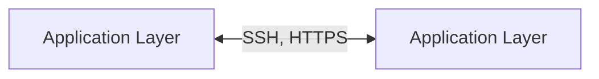
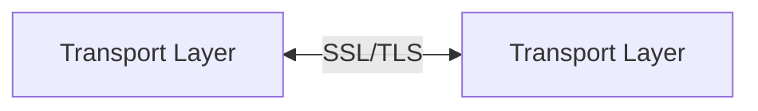
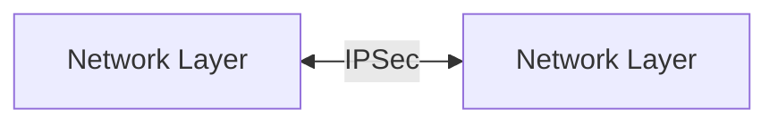

Spesso i web server esposti sulla rete sono potenziali punti di accesso per un attaccante.

Si possono introdurre meccanismi di sicurezza a diversi livelli dello stack ISO/OSI:
- **IPSec** -> a livello IP (lv. 3)
- **SSL/TLS** -> a livello TCP (lv. 4)
- a livello applicazione esistono una grande varietà di protocolli (e.g. Kerberos o i protocolli di mailing sicuro)

# TLS (Transport Layer Security)
Secure Socket Layer (**SSL**) e Transport Layer Security (**TLS**) forniscono una connessione sicura tra due dispositivi su Internet e la rete locale.
TLS è il successore di SSL.

Si compone di una serie di protocolli che fanno affidamento a TCP.

## TLS Architecture
Individuiamo due entità principali:
- **TLS connection** -> relazione tra peer
	- ogni connessione è associata ad una sessione
- **TLS session** -> relazione tra client e server
	- necessità una *fase di handshake*
	- vengono stabilite dei parametri di crittografia comune a tutte  le comunicazioni facenti parti di una sessione
	- evitano la trasmissione continua di parametri di sicurezza

Lo **stato** di una TLS connection è rappresentato dai seguenti parametri:
- `session identifier` -> identifica una connessione
- `peer certificate` -> certificato X.509 del peer
- `cipher spec` -> specifiche del cifrario e del MAC utilizzato
- `master secret` -> segreto condiviso tra peer

Lo **stato** di una TLS session è rappresentato dai seguenti parametri:
- `server and client random`
- `server/client MAC secret` -> chiave MAC usata dal server/client
- `server/client write key` -> chiave simmetrica condivisa
- `IV` -> creato durante la fase di handshake
- `sequence numbers` -> sia il client che il server mantengono un sequence number per identificare l'ordine dei messaggi (resettato al comando di `change cipher`)

## TLS Protocols
TLS individua due protocolli uno per la creazione della sessione, **Handshake Protocol**, e uno per il trasferimento delle informazioni, **Record Protocol**.

### Handshake protocol
Utilizza la crittografia asimmetrica per trasferire informazioni tra client e server, tra cui la versione utilizzata, i cifrari utilizzati e le chiavi segrete.
Opzionalmente implementa la mutua autenticazione.

Fase (1) - scambio di informazioni preliminari:
1. $Client \rightarrow Server$ `client_hello`:  info condivise di sessione (e.g. versione, ID sessione, cipher suite)
2. $Server \rightarrow Client$ `server_hello`: info condivise
Fase (2) - il server invia il certificato ed inizia lo scambio di chiavi:
3. $Server \rightarrow Client$ `certificate`: catena X.509
4. $Server \rightarrow Client$ `server_key_exchange`: inizia lo scambio di chiavi
5. $Server \rightarrow Client$ `certificate_request`: richiede il certificato del client
6. $Server \rightarrow Client$ `server_hello_done`
Fase (3) - il client, dopo aver verificato il certificato del server, procede all'invio del certificato se richiesto e delle informazioni di scambio chiavi
7. $Client \rightarrow Server$ `certificate`: catena X.509 del client
8. $Client \rightarrow Server$ `client_key_exchange`: conclude lo scambio di chiavi di sessione
9. $Client \rightarrow Server$ `certificate_verify`: firma digitale del certificato client
Fase (4) - cambio del cifrario (opzionale) e terminazione dell'handshake
10. $Client \rightarrow Server$: `change_cipher_spec`
11. $Client \rightarrow Server$ `finished`
12. $Server \rightarrow Client$ `change_cipher_spec`
13. $Server \rightarrow Client$ `finished`

### Record Protocol
Usa le chiavi simmetriche condivise attraverso l'handshake per introdurre **confidenzialità** (cifrario simmetrico), **integrità** (attraverso i MAC) e **autenticità** (certificati X.509) durante lo scambio di messaggi.

I dati seguono un processo preciso prima di essere inviati:
1. *Frammentazione* dei dati in gruppi
2. Ogni gruppo viene *compresso* e gli viene *allegato il MAC* prodotto dal frammento compresso
3. Messaggio compresso e MAC vengono *crittografati* attraverso le chiavi simmetriche di sessione
4. Al payload crittografato viene *aggiunto un TLS record header* (i.e. metadati) e spedito sulla rete 

![[tls-record-schema.png]]

## TLS Attack
Anche TLS può essere bersaglio di attacchi:
- attacco all'handshake
- attacco al record e ai dati
- attacco, indiretto, alla PKI (Public Key Infrastructure)

## TLS v1.3
L'ultima versione di TLS, adottata nel 2015.

Rispetto alla versione 2 (del 2008):
- rimuove le impostazioni considerate poco sicure (e.g. cifrari che non offrono la cifratura autenticata)
- sostituisce RSA con Diffie-Hellman autenticato o Elliptic Curve Diffie-Hellman per lo scambio di chiavi

---

# HTTPS
HTTPS è la versione sicura di HTTP che introduce la cifratura dei messaggi tra browser e sito web, garantendo protezione end-to-end, grazie a ***confidenzialità***, ***integrità*** ed ***autenticazione***.

HTTPS per essere sicuro fa uso di TLS, ==il client HTTP implementa anche TLS==.
1. il client inizializza la connessione attraverso il *TLS Handshake*
2. finita la fase di handshake ogni messaggio HTTP verrà inviato come TLS application data (quindi cifrato)

Una connessione HTTPS richiede:
- a livello HTTP i due client stabiliscono una connessione
- a livello TLS viene creata una **sessione** tra i due client; una sessione permette più di una connessione HTTP

La chiusura di una connessione HTTPS viene indicata nel record HTTP: `Connecttion: close`.
Questo comporta la chiusura della connessione TLS e di conseguenza di quella TCP.

Se una connessione TLS viene chiusa prima dello scambio di tutti i messaggi il protocollo HTTPS è allertato (potrebbe riconoscere un attacco).

---

# SSH (Secure Shell)
SSH è un protocollo che permette l'utilizzo di una shell remota su un client attraverso l'uso di una connessione sicura.

SSH fa affidamento a tre protocolli che girano al di sopra di TCP:
- **Transport Layer Protocol** -> provvede all'autenticazione del server, alla confidenzialità e all'integrità (potrebbe introdurre compressione)
- **User Authentication Protocol** -> autentica il client verso il server
- **Connection Protocol** -> gestisce il tunnel cifrato attraverso diversi canali logici

## Transport Layer Protocol
L'autenticazione del server avviene attraverso crittografia asimmetrica, un server può gestire svariati cifrari simmetrici per soddisfare il maggior numero di host.

Lo standard definisce due modelli di fiducia:
- il client possiede un DB logico che associa ogni host alla corrispondente public key
- si sfrutta una CA per validare le chiavi pubbliche

Fasi della comunicazione:
0. Viene stabilita la connessione TCP
1. Client e server si scambiano informazioni preliminari, come gli identificativi ed i parametri usati per lo scambio delle chiavi
2. Procedura di scambio chiavi
3. Decisione del servizio al quale si vuole accedere

![[ssh-tlp-packet.png]]

Le chiavi utilizzate per la fase di cifratura e creazione del MAC, sono generate dalle chiavi condivise durante la fase (2).

## User Authentication Protocol
Permette al client di autenticarsi nei confronti del server.

Durante la fase di autenticazione il client deve specificare tre informazioni fondamentali:
- `username` che identifica l'utente
- `service name` che identifica il servizio al quale si vuole accedere
- `method name` che identifica il metodo di autenticazione, esso può essere
	- *public key* -> il client manda un messaggio firmato che il server controlla
	- *password* -> il client invia una password cifrata attraverso TLS
	- *hostbased* -> verifica direttamente l'identità dell'host attraverso il controllo di una firma (come per public key)

Scambio di messaggi:
1. $Client \rightarrow Server$: il client invia una richiesta specificando il proprio `username`
2. $Server \rightarrow Client$: il server controlla l'esistenza del client e la sua validità, se valido va a (3)
3. $Server \rightarrow Client$: il server invia una lista di metodi di autenticazione validi
4. $Client \rightarrow Server$: il client sceglie un metodo di autenticazione valido ed invia i parametri relativi
5. $Server \rightarrow Client$: se l'autenticazione va a buon fine allora il server conferma l'avvenuta autenticazione

## Connection Protocol

---

# Schema riepilogativo

Sicurezza nello stack ISO/OSI:

