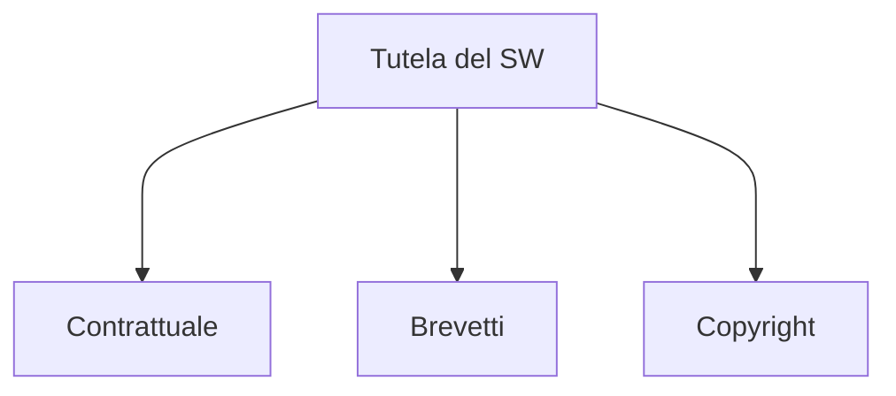

## Contratto

La stesura di un contratto si divide in fasi:
- **Fase precontrattuale** - negoziazione tra le parti
	- attività volte alle trattative
	- *lettera d'intenti* - documenti di inizio trattativa
		- funzione preliminare di instaurazione rapporto
		- vaga e generica
	- *verbali di riunione* - trascrittura della riunione
		- possono essere prova in tribunale se scritti bene
		- comprovano gli incontri
	- *studio di fattibilità* - previsione degli obiettivi e relativi costi
		- può essere un lavoro costoso e complesso
	- Disposizioni imperative - comportamento tra le parti
		- il contratto deve essere eseguito in buona fede
- **Stipulazione del contratto**

---

## Licenza Software
Il software è un **bene** tutelato.

I diritti d'autore si possono acquistare
- a titolo originario (crearlo)
	- sviluppo interno, non c'è bisogno di un contratto
	- sviluppo esterno
		- SW già esistente
			- acquisizione definitiva
			- acquisizione temporanea
				- licenza esclusiva
				- licenza non esclusiva
		- SW non esistente
- a titolo derivativo (acquistarlo)

Contratti di informatica:
- **licenza SW**
- **sviluppo SW**
- **manutenzione SW**
- disaster recovery

### Licenza d'uso
Trasferimento all'utente di **utilizzare** un determinato software.

