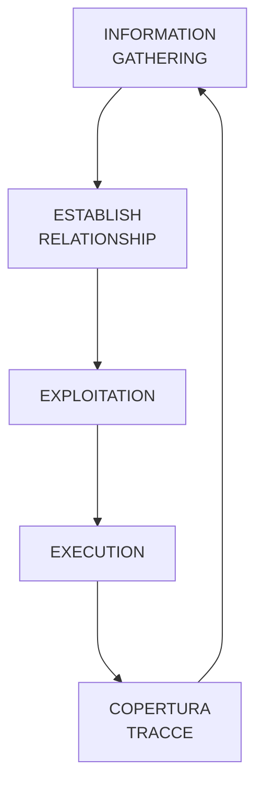

Si possono spendere milioni di dollari per difendere la propria insfrastruttura dal punto di vista tecnologico, l'unico vero problema sarà sempre il fattore umano. Basta imbrogliare la persona giusta e il gioco è fatto.

L'ingegneria sociale è una tecnica che mira ad ottenere dati, informazioni, accessi, risorse e molto altro sfruttando la debolezza e l'ignoranza umana.
La maggior parte dei problemi informatici inizia con un errore umano.

Ogni attacco di ingegneria sociale segue, in linea di massima, le stesse fasi di vita:

Ci sono due tipi di approcci, quelli fisici e quelli attraverso il computer:
- fisici
	- ricerca nella spazzatura di info
	- origliare
	- pedinare
- computer based
	- phishing e le sue sotto-categorie [att&ck matrix](https://attack.mitre.org/techniques/T1566/)

## Phishing
Il phishing è una tecnica che consiste, sostanzialemente, nell'imbrogliare un utente umano con diversi scopi:
- accesso a siti malevoli
- download di file modificati

*Adversaries may send victims emails containing malicious attachments or links, typically to execute malicious code on victim systems. Phishing may also be conducted via third-party services, like social media platforms. Phishing may also involve social engineering techniques, such as posing as a trusted source, as well as evasive techniques such as removing or manipulating emails or metadata/headers from compromised accounts being abused to send messages.*

**Purtroppo** troppo spesso gli attacchi di phishing e spear-phishing sono efficaci.

Il phishing "vanilla" targetta tantissimi utenti con email generiche ma ci possono altre tipologie di approcci:
- spear-phishing, il target diventa una persona/impiegato specifico che viene studiato e catalogato per individuare i punti deboli
- whale-phishing, il target diventa una persona importante per l'organizzazione che viene profilata prima dell'attacco
- vishing, phishing per telefono
- SMishing, phishing per SMS

Con il phishing si delineano un'ampia serie di tecniche psicologiche atte ad imbrogliare l'utente, come:
- fingersi autorità fidate o giudiziarie
- imporre un falso limite di tempo su azione bancarie fittizie, per imporre un senso di urgenza
- consistenza nelle mail e nel comportamento dell'attaccante
- mostrare informazioni personali, facilmente reperibili sulla rete

Con l'avvento (ormai non più) delle intelligenze artificiali è sempre più facile riprodurre il frontend dei siti web per ingannare gli utenti ed indirizzare a domini malevoli.

### GoPhish
GoPhish è un framework creato per organizzare campagne di test di phishing. Esso permette di creare payload di phishing, monitorare l'utente e mettere in evidenza i dati raccolta attraverso la campagna.

Spesso viene usato per testare, non solo la parte umana, ma anche quella tecnologica per verificare filtri e firewall.

