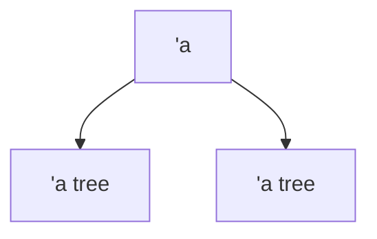

<small>19 febbraio 2024</small>

## Parte 1
In ML si possono fare diversi tipi di **dichiarazioni**:
- `val`, per i valori
- `fun`, per funzioni ricorsive
- `type`, modo per fare una macro di tipi già esistenti
- `datatype`, crea e definisce un nuovo tipo
- `abstype`, tipo astratto
- `exception`, per le eccezioni

Ci sono diverse **operazioni** che si possono fare, e.g.:
- `div`, divisione tra interi
- `/`, divisione per reali

---

Le **tuple** sono insieme di dati composte da _n_ elementi di tipi eterogenei. In realtà non altro che abbreviazioni di records (vediamoli come i dizionari).
ML non ha bisogno del subtyping per riordinare i record.

---

Le **liste** sono oggetti polimorfi.

La funzione *app* permette di appendere una lista ad un altra:

```ml
fun app nil l = l
	| app (h::t) l = h::(app t l);

val app = fn : 'a list -> 'a list -> 'a list
```

Tale funzione è definita per pattern matching sul primo argomento, esso può essere:
- `nil`, la lista vuota e quindi si ritorna il secondo argomento `l`
- `(h::t)`, ovvero una lista generica dotata di head `h` e tail `t`, in questo caso si aggiunge alla coda il secondo argomento richiamando `app`

```ml
app [1,2,3] [4,5,6];
val it = [1,2,3,4,5,6] : int list
```

Questa funzione è built-in grazie all'operatore `@`.

---

L'operatore **let** permette lo scoping statico da usare all'interno dello scope. Ovviamente possono essere *annidati* e possono dare vita a *shadowing*, ovvero alla ridefinizione dello stesso placeholder.

---

Il **Pattern Matching** permette di associare nome di variabili a valori, informalmente permette di andare a "scomporre" le strutture:

```ml
var (left, right) = ("Ciao", 4)
```

Posso usare il pattern matching per diverse strutture dati, per esempio con le liste...

```ml
val x::y = [5,6,7,8]
--> val x = 5 : int
--> val y = [6,7,8] : int list
```

... ma anche con i record:

```ml
val {flag=y, count=x} = {count=2, flag=true}
```

allora otterremo che `y = 2` e `x = true`.

Quando si fa pattern matching bisogna stare attenti ad alcune cose:
- *wildcards*, è una specie di jolly che permette di scartare parte della struttura
- *bugs*, NON si possono duplicare le variabili all'interno della parte di dichiarazione del pattern matching

---

Le **funzioni** sono elementi *first order*, quindi si introduce un costrutto per creare le funzioni ricorsive: `fun`.

```ml
fun fact = if ...
```

Si può anche qua usare pattern matching e quindi usare una definizione per induzione.

Le funzioni possono essere composte e la ==strategia di valutazione== è per default ==Call-By-Value==.

Altro concetto fondamentale relativo alle funzioni è lo *scope*, ovvero l'ambiente di esistenza di una specifica variabile.

Quando si fa funzione per pattern matching, bisogna assicurarsi di coprire tutti i possibili pattern. L'interprete NON segnalerà errori in caso di mancanza di pattern.
In caso di matching ridondanti con diversi return verrà segnalato errore, perché non saprebbe cosa restituire.

La funzione map è di tipo high order, data una lista `l` e una funzione `f` la map applicherà la funzione `f` a tutti gli elementi di `l`.
In generale se la lista è vuota ritorna la lista vuota se no applica la funzione alla head e concatena ri-eseguendo la funzione map sulla tail.

---

Un **datatype** permette di costruire un tipo che NON esiste, la macro invece permette di comporre variabili primitive (in questo caso si usa **type**).

Con i **datatype** si possono costruire tipi di una certa complessità. I tipi composti sono costruiti attraverso un costruttore che specifica per ogni nuovo tipo dei parametri.

```ml
datatype 'a tree = Empty
					| Node of 'a * 'a tree * 'a tree;
```

Questo datatype permette di rappresentare una albero binario che seguo lo schema:


> P.S. quando si mette l'apostrofo prima di una variabile allora si sta intendendo un tipo **polimorfo**, ovvero un tipo la cui natura è assunta run-time, quindi non la si conosce a priori prima dell'esecuzione.
> Si può informalmente vedere come il tipo T in Java.

E' possibile andare a specificare per ogni tipo definito dal datatype anche il valore di ritorno:

```ml
datatype expr = constant of int
				| var of string
				| sum of expr * expr
```

L'asterisco permette di definire il tipo sum tale che:
$$\texttt{sum : expr} \rightarrow \texttt{expr}$$
Quindi si potrebbe costruire una bella grammaticozza diddio (?)

---

Con l'operatore **case** posso "smontare" una struttura. In realtà possiamo ottenere un output in base al tipo generato dal costruttore precedentemente.

---

Le **referenze** permettono di andare a tipare una ==locazione di memoria==.
Per leggere una locazione bisogna eseguire la de-referenziazzione con l'operatore `!`.


## Parte 2 - Interprete del linguaggio While

<small>20 febbraio 2024</small>

Abbiamo diverse **categorie sintattiche**:
- booleani
- interi
- locazioni
- operazioni
- espressioni

Inoltre è definito il concetto di **store**, associa ad una locazione un valore, **parziale** perché non per forza lo fa per tutte le locazioni.

Con l'update possiamo aggiornare uno store: $$\texttt{s[ l} \rightarrow \texttt{n ]}$$
Andremo a definire una small-step semantic che specifichi le regole.

Per riferimento: pagina 112 libro pdf.

La prima cosa da fare è quella di andare a definire i tipi astratti della sintassi, quindi:
- locazioni
- operatori
- espressioni, definite in modo induttivo

```ml
type loc = string

datatype oper = Plus | GTEQ

dataype expr = 
		| Integer of int
		| Boolean of bool
		| Op of expr * oper * expr
		| Assign of loc * expr
		| Deref of loc
		| Skip
		| Seq of expr * expr
		| While of expr * expr
```

Successivamente bisogna andare a specificare l'interprete della semantica:
- `lookup`, prende uno store e una locazione e ritorna un `int option`
- `update`, dato uno store, una locazione ed un intero allora va ad aggiornare la locazione con il nuovo intero

P.S.: Il tipo `option` permette di ritornare `nil` in caso la locazione non fosse definita.

```ml
type store = (loc * int) list

fun lookup ( [], l ) = NONE
	| lookup ( (l',n')::pairs, l ) = 
	  if l=l' then SOME n' else lookup (pairs, l)
```

Se cerco una locazione `l` su store vuoto ottengo `NONE` (per questo ritorna `int option`), se invece ho una lista con in testa coppia l',n' allora controllo se quello che cerco è l', se no prosegue scartando la testa appena esaminata.

La funzione `update` è definita in funzione di una `update'`, vedere su pdf (pagina 113).

In seguito è necessario definire la semantica vera e propria e quindi le varie regole, sarà left-to-right.

La funzione `reduce` prende una configurazione espressione, store e ritorna un altra espressione, store **elaborata**.
Questa funzione va, sostanzialmente, ad implementare le regole e gli assiomi definiti dalla semantica operazionale.

Inoltre si introduce una `funzione` evaluate per implementare una big-step semantic, essa va a valutare fino alla fine le espressioni.